# Rappi2 — API de Logística (FastAPI + PostgreSQL + MongoDB)

## Integrantes

- Huamani Huamani Jhordan
- Flores Leon Miguel
- Mares Graos Frederick
- Ortiz Castañeda Jorge

---

## Roles

### Jorge Ortiz Castañeda

**Rol:** Líder técnico / Backend principal  
**Porcentaje de participación:** 100%

**Aportes:**

Arquitectura y arranque del sistema:

- `main.py`
- Configuración general
- Estructura de carpetas
- `core/`
  - Configuración
  - Conexión DB
  - Seguridad base
- Docker y ejecución:
  - `Dockerfile`
  - `docker-compose.yml`
  - `.env.example`

Seguridad y acceso:

- `api/auth.py`
  - Login
  - Register
  - Refresh
  - Logout
- JWT
- Refresh tokens
- Helpers de seguridad:
  - `core/security.py`
- Dependencias de auth/permisos:
  - `api/dependencies.py`

Diseño de base de datos y modelo:

- `models/`
- Tablas SQLAlchemy
- Migraciones:
  - `alembic/` si aplica en su repo

Flujos principales del negocio:

- Órdenes / Asignaciones / Rutas como flujo completo:
  - `api/ordenes.py`
  - `api/asignaciones.py`
  - `api/rutas.py`
- Integración con servicios externos:
  - `services/ors_service.py`

---

### Jhordan Huamani Huamani

**Rol:** Backend developer  
**Porcentaje de participación:** 23%

**Aportes:**

Módulos CRUD + reglas de negocio secundarias:

- Clientes:
  - `api/clientes.py`
  - Schemas/models relacionados
- Conductores y vehículos:
  - `api/conductores.py`
  - `api/vehiculos.py`
- Pagos y facturas:
  - `api/pagos.py`
  - `api/facturas.py`

Incidencias y evidencias:

- `api/incidencias.py`
- `services/mongo/evidencias_service.py`
- Schemas Mongo asociados

Apoyo a endpoints de reportes:

- `api/reportes.py`
  - Consultas
  - Agregados
  - KPIs

---

### Miguel Flores León

**Rol:** QA / Testing + Documentación  
**Porcentaje de participación:** 100%

**Aportes:**

Documentación principal:

- `README.md`
  - Instalación
  - Ejecución
  - Endpoints clave
  - Ejemplos

Colecciones de pruebas y validación:

- `postman.json`
- Colección Postman o Thunder Client
- Checklist de pruebas:
  - Casos felices
  - Errores
  - Login
  - Permisos
  - CRUDs
  - Rutas
  - Tracking

Pruebas automatizadas:

- Pytest para endpoints clave:
  - Auth
  - Órdenes
  - Asignaciones
- Validación de respuestas:
  - Status codes
  - Esquemas
  - Permisos

---

### Frederick Mares Graos

**Rol:** Integración / DevOps ligero + soporte  
**Porcentaje de participación:** 100%

**Aportes:**

Configuración y entorno:

- `requirements.txt`
- Dependencias limpias
- `.env.example`
- Manejo de variables
- Scripts de inicialización:
  - `scripts/seed_admin.py` o similares

Persistencia e infraestructura:

- Conexión PostgreSQL/Mongo:
  - `core/database.py`
  - `core/mongo.py`
- Indexación/TTL en Mongo:
  - Tracking
  - Auditoría
  - Geocercas
- Desde:
  - `services/mongo/*`

Middleware y logging:

- `middleware/audit.py`
- Logging
- Manejo de errores

---

## Descripción breve del sistema

Rappi2 es una API de logística construida con FastAPI para gestionar entregas: clientes,
órdenes, asignaciones a conductores, planificación de rutas, y funcionalidades transversales
como tracking GPS, geocercas, notificaciones, auditoría y evidencias multimedia. Está diseñada
como una solución híbrida: usa PostgreSQL para datos transaccionales y MongoDB para datos
geoespaciales/logs y contenido no relacional.

---

## Motivación

La motivación técnica y de negocio que se desprende del diseño es:

- Separar lo transaccional de lo operacional/geoespacial:
  - PostgreSQL para integridad, relaciones y consistencia (usuarios, órdenes, pagos, etc.).
  - MongoDB para eventos y consultas geoespaciales (pings GPS, geocercas), auditoría
    con TTL y evidencias.
- Soportar procesos reales de logística: asignación de órdenes, estados de entrega,
  seguimiento, KPIs/reportes, y auditoría de acciones.
- Seguridad y control de acceso mediante RBAC (roles/permisos) y autenticación con
  JWT + refresh tokens con rotación obligatoria.

---

## Requerimientos

### Requerimientos funcionales principales

- Autenticación y sesiones
  - Registro, login, refresh token, logout.
  - Persistencia de refresh tokens (revocables).
- RBAC (Roles/Permisos)
  - Gestión de roles y permisos por (recurso, acción) con comodines `*`.
  - Gestión operativa
  - CRUD de clientes y direcciones.
  - CRUD de órdenes, pagos, facturas.
  - Gestión de conductores y vehículos.
  - Flujo de asignaciones: crear, iniciar, finalizar; transiciones de estado
    (orden y conductor).
- Planificación de rutas
  - Integración con OpenRouteService para planificar y registrar rutas.
- Tracking GPS y geocercas
  - Guardar pings GPS y obtener métricas/estadísticas.
  - Consultas geoespaciales (conductores cerca, punto dentro de geocerca).
- Auditoría
  - Registrar requests HTTP en MongoDB y consultar resúmenes.
- Evidencias
  - Subida/descarga de archivos relacionados a incidencias (p.ej., fotos)
    usando GridFS.
- Reportes
  - Endpoints de dashboard/KPIs, ventas, SLA, top clientes, eficiencia de
    conductores, etc.

### Requerimientos no funcionales

- Asíncrono: API y DB access async (FastAPI + SQLAlchemy async + Motor).
- Contenerización: arranque con Docker Compose.
- Migraciones: Alembic para versionar esquema PostgreSQL.
- Seguridad:
  - Hash de contraseñas (bcrypt).
  - JWT HS256.
  - Refresh tokens con rotación y revocación.
  - CORS configurable.
- Observabilidad mínima: auditoría HTTP en MongoDB (y TTL).

---

## Arquitectura

### Estilo y componentes

Arquitectura tipo API monolítica modular:

- `main.py`: arranque de la app FastAPI.
- `api/`: routers por dominio (roles, usuarios, clientes, órdenes, tracking, auditoría, etc.).
- `models/`: modelos SQLAlchemy (PostgreSQL).
- `schemas/`: esquemas Pydantic (DTOs).
- `services/`:
  - Integración externa OpenRouteService (`ors_service.py`).
  - Servicios Mongo (tracking, geocercas, notificaciones, auditoría, evidencias).
- `middleware/`:
  - Middleware de auditoría (escribe logs a Mongo).
- `core/`:
  - Config (`config.py`)
  - PostgreSQL async (`database.py`)
  - Mongo (`mongo.py`)
  - Seguridad (JWT, hashing, etc.)
- `alembic/`: migraciones.
- `scripts/`: seed inicial (roles/permisos/admin).

---

## Persistencia híbrida (PostgreSQL + MongoDB)

- PostgreSQL: entidad-relación, transacciones, integridad referencial.
- MongoDB: colecciones para:
  - Tracking GPS (alto volumen, geoespacial)
  - Geocercas (polígonos/LineStrings, geoespacial)
  - Notificaciones
  - Auditoría con TTL
  - Evidencias (metadatos + archivos en GridFS)

---

## Esquema de Bases de Datos

### PostgreSQL

Su diseño integra diferentes módulos relacionados entre sí, como usuarios, clientes,
órdenes, conductores, vehículos, rutas, pagos e incidencias, facilitando el control y
seguimiento de todo el proceso del servicio.

- El esquema de la base de datos está orientado a un sistema de gestión logística
  y transporte.
- Gestión de usuarios: incluye las tablas usuarios, roles, permisos y tokens, que
  permiten controlar el acceso al sistema y definir qué acciones puede realizar
  cada usuario.
- Gestión de clientes: se manejan los datos de los clientes y sus direcciones
  mediante las tablas clientes y clientes_direcciones.
- Gestión de órdenes: la tabla ordenes registra los pedidos o servicios solicitados,
  incluyendo origen, destino, estado, fecha de creación y costo total.
- Gestión operativa: las tablas conductores, vehículos y asignaciones permiten
  asignar un conductor y un vehículo a cada orden.
- Planificación de rutas: las tablas rutas_planificadas y paradas permiten registrar
  la ruta, distancia estimada, tiempo aproximado y puntos de parada del servicio.
- Gestión económica: las tablas pagos y facturas permiten controlar los pagos
  realizados y la emisión de comprobantes.
- Control de incidencias: la tabla incidencias registra problemas o eventos
  ocurridos durante la ejecución del servicio.
- En conjunto, la base de datos permite administrar clientes, usuarios, órdenes,
  transporte, rutas, pagos, facturación e incidencias de forma organizada.

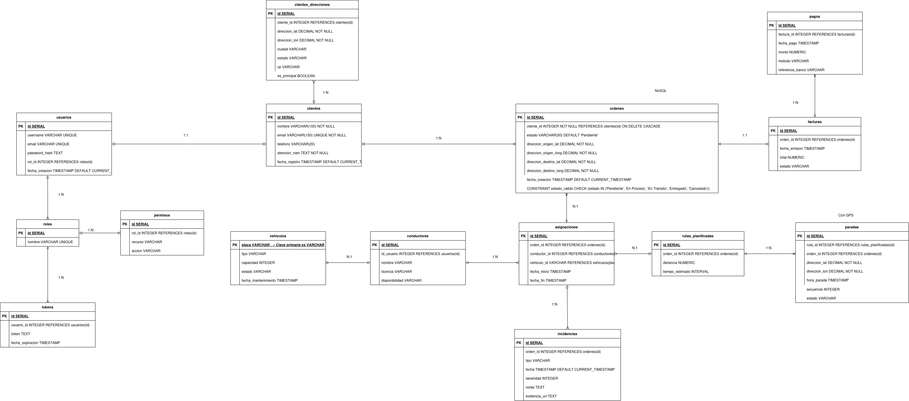

---

### MongoDB

El siguiente esquema corresponde a una base de datos NoSQL en MongoDB, diseñada
para complementar el sistema logístico mediante colecciones orientadas al seguimiento
operativo, viajes, alertas, geocercas y estadísticas. A diferencia de una base de datos
relacional, la información se organiza en documentos JSON, lo que permite almacenar
datos flexibles y consultar eventos del servicio de manera rápida.

- Colección `eventos_operacionales`: registra eventos generados durante la
  operación, como el escaneo de paquetes, junto con la fecha, dispositivo utilizado
  y datos adicionales del evento.
- Colección `alerta_logistica`: almacena alertas relacionadas con problemas
  logísticos, como desvíos de ruta o incumplimiento de geocercas, indicando si la
  alerta fue resuelta o no.
- Colección `viajes`: guarda información resumida de cada viaje, incluyendo la orden
  asociada, el conductor, la distancia estimada, el tiempo estimado y la cantidad de
  paradas.
- Colección `geocercas`: define zonas geográficas importantes, como almacenes o
  áreas de control, usando coordenadas en formato de polígono.
- Colección `estadisticas_por_orden`: almacena métricas de cada orden, como
  distancia recorrida, tiempo en tránsito y velocidad promedio.
- En conjunto, estas colecciones permiten monitorear la operación logística en
  tiempo real, controlar rutas, detectar incidencias y generar estadísticas útiles
  para la toma de decisiones.


---

## Evidencias Postman

### Auth

#### `POST` /api/auth/login — Iniciar sesión
- **Auth:** No requiere
- **Content-Type:** `application/x-www-form-urlencoded`
- **Body:** `username` · `password`

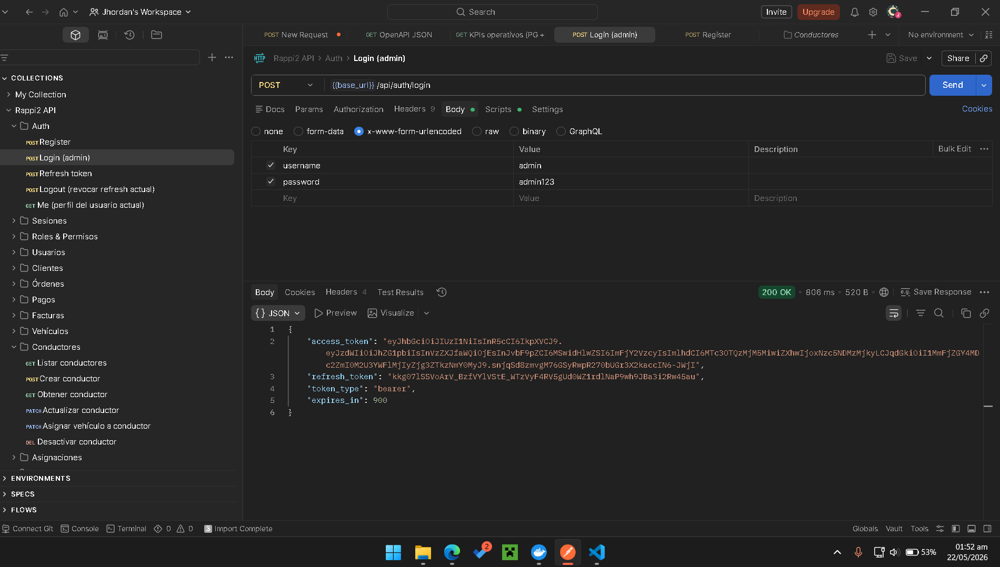

#### `POST` /api/auth/register — Registrar usuario
- **Auth:** No requiere
- **Body (JSON):**
```json
{
  "username": "string",
  "email": "user@example.com",
  "password": "string",
  "rol_id": null,
  "nombre": "string",
  "telefono": "string",
  "cc_id": "string"
}
```

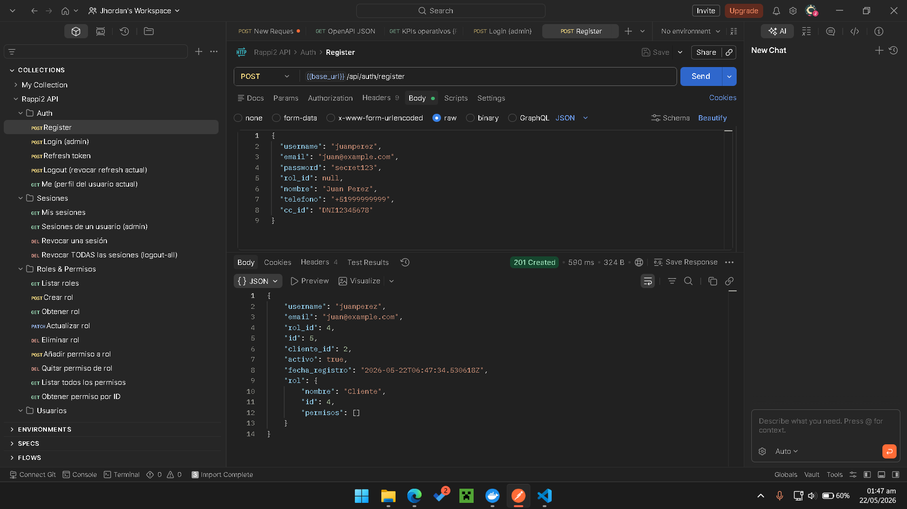

#### `GET` /api/auth/me — Obtener usuario autenticado
- **Auth:** Bearer Token (JWT)
- **Body:** No requiere

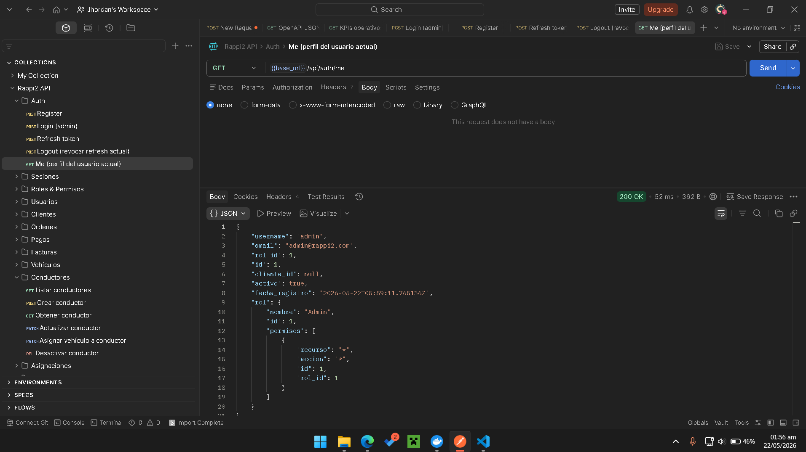

#### `POST` /api/auth/refresh — Renovar tokens
- **Auth:** No requiere
- **Body (JSON):**
```json
{ "refresh_token": "string" }
```

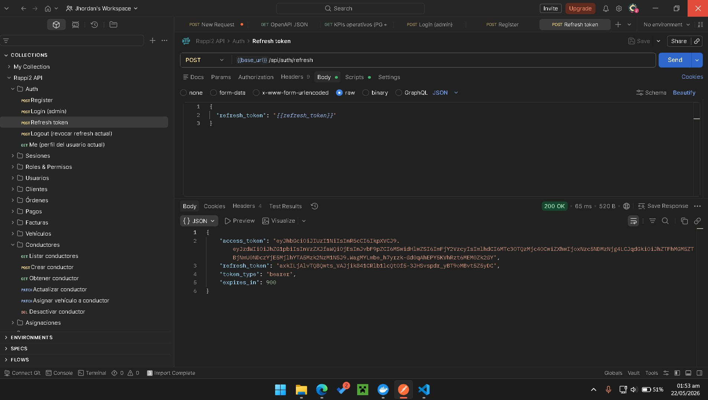

#### `POST` /api/auth/logout — Cerrar sesión
- **Auth:** No requiere
- **Body (JSON):**
```json
{ "refresh_token": "string" }
```

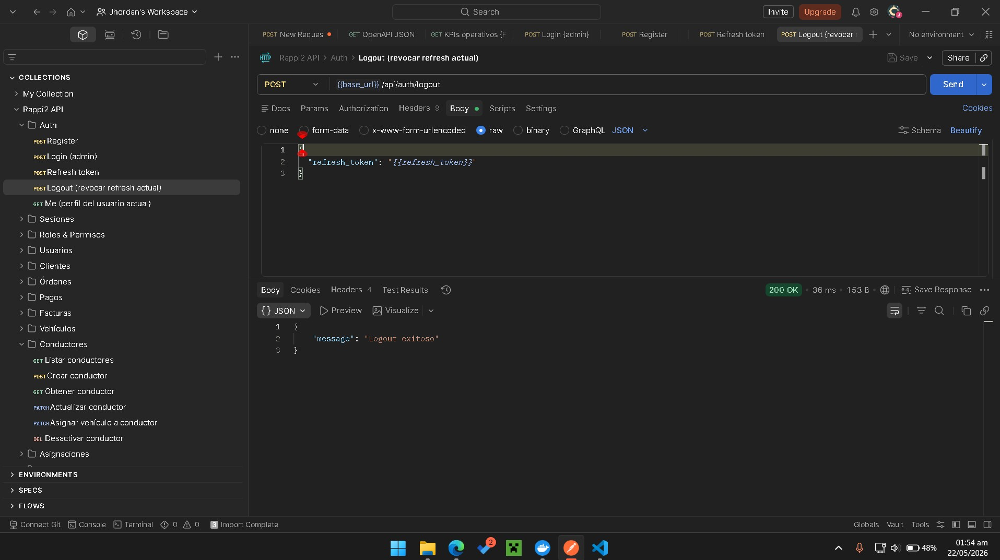

---

### Sesiones

#### `GET` /api/usuarios/me/sesiones — Mis sesiones activas
- **Auth:** Bearer Token (JWT)
- **Query params:** `activos_solo` (bool, default: true)

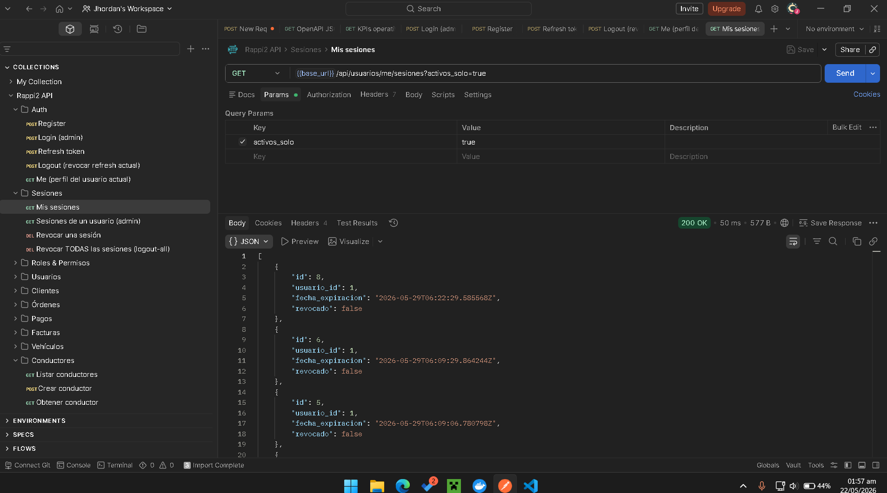

#### `GET` /api/usuarios/{usuario_id}/sesiones — Sesiones de un usuario
- **Auth:** Bearer Token (JWT) · Permiso: `sesiones:read`
- **Query params:** `activos_solo` · `skip` · `limit`

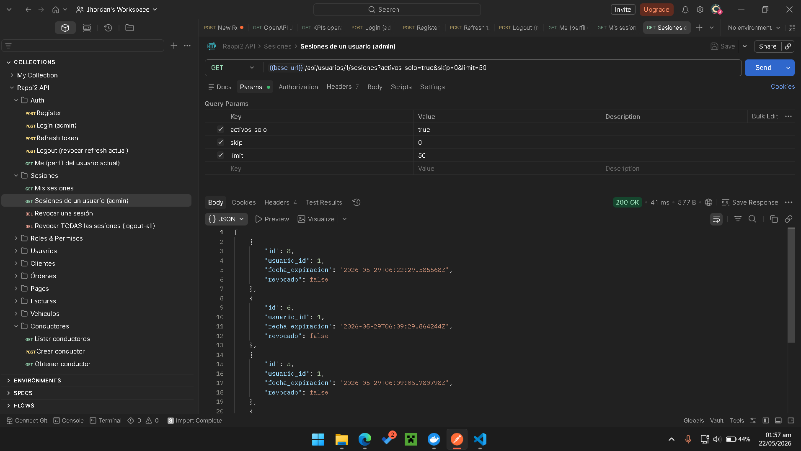

#### `DELETE` /api/usuarios/{usuario_id}/sesiones/{sesion_id} — Revocar una sesión
- **Auth:** Bearer Token (JWT) · Permiso: `sesiones:delete`
- **Body:** No requiere
- **Response:** `204 No Content`

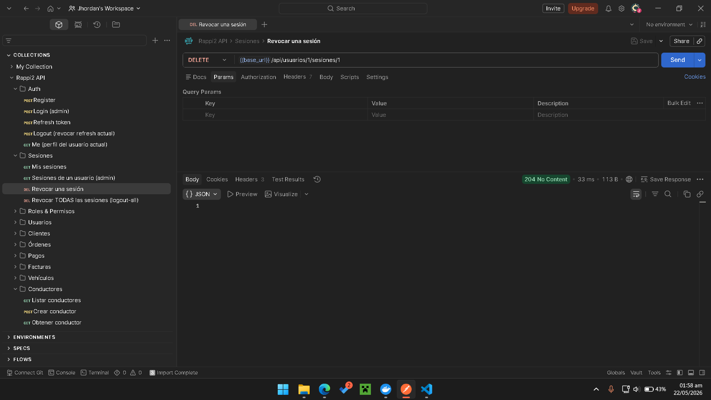

#### `DELETE` /api/usuarios/{usuario_id}/sesiones — Revocar todas las sesiones
- **Auth:** Bearer Token (JWT) · Permiso: `sesiones:delete`
- **Body:** No requiere

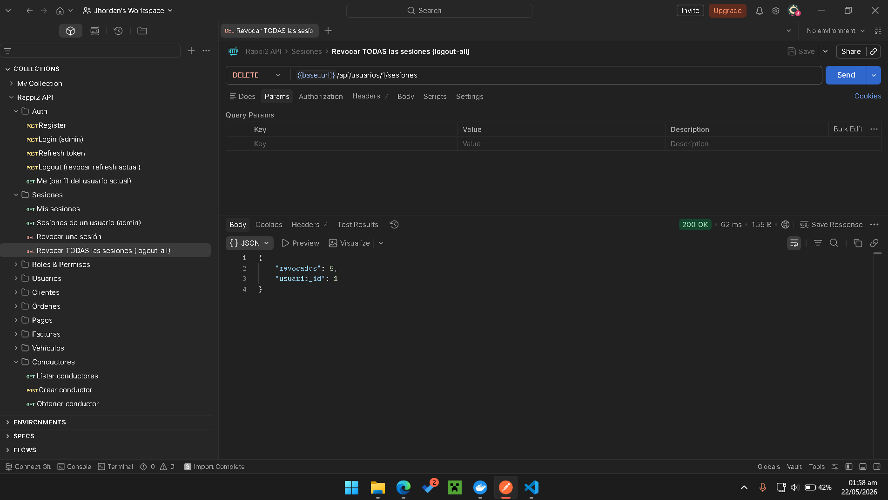

---

### Roles y permisos

#### `GET` /api/roles/ — Listar todos los roles
- **Auth:** Bearer Token · Permiso: `roles:read`

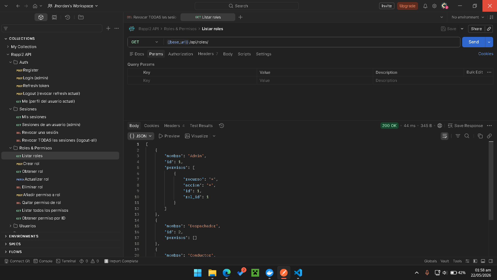

#### `GET` /api/roles/{rol_id} — Obtener un rol por ID
- **Auth:** Bearer Token · Permiso: `roles:read`

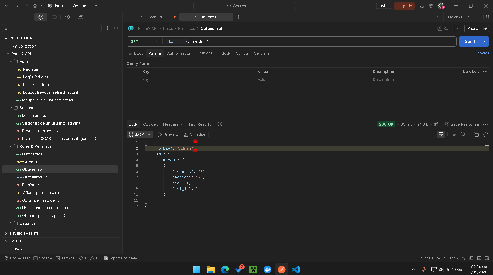

#### `PATCH` /api/roles/{rol_id} — Actualizar nombre de rol
- **Auth:** Bearer Token · Permiso: `roles:write`
- **Body (JSON):**
```json
{ "nombre": "string" }
```

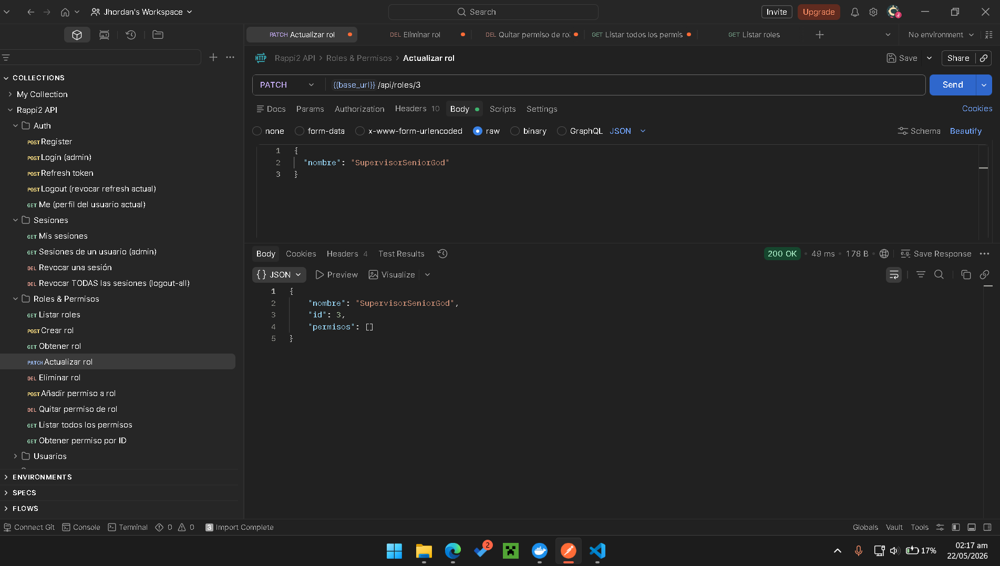

#### `DELETE` /api/roles/{rol_id} — Eliminar un rol
- **Auth:** Bearer Token · Permiso: `roles:delete`
- **Response:** `204 No Content`

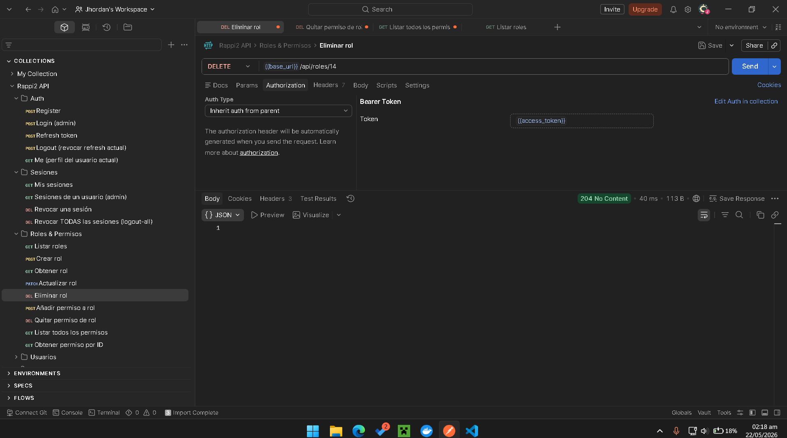

#### `POST` /api/roles/{rol_id}/permisos — Agregar permiso a un rol
- **Auth:** Bearer Token · Permiso: `roles:write`
- **Body (JSON):**
```json
{ "recurso": "string", "accion": "string" }
```


#### `DELETE` /api/roles/{rol_id}/permisos/{permiso_id} — Eliminar permiso de un rol
- **Auth:** Bearer Token · Permiso: `roles:write`
- **Response:** `204 No Content`


#### `GET` /api/roles/permisos/all — Listar todos los permisos
- **Auth:** Bearer Token · Permiso: `roles:read`
- **Query params:** `rol_id` · `recurso` (opcionales)

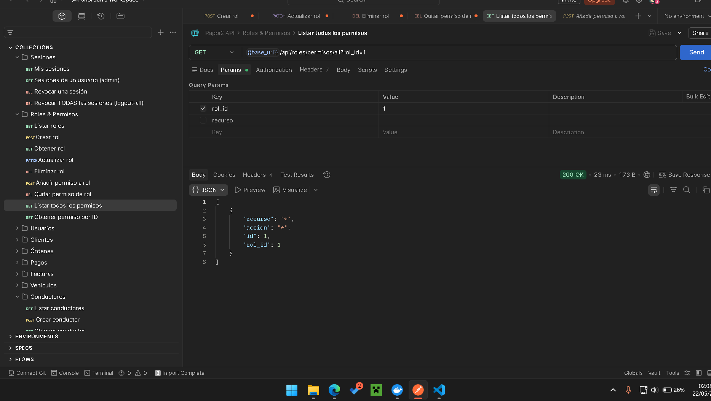

#### `GET` /api/roles/permisos/{permiso_id} — Obtener un permiso por ID
- **Auth:** Bearer Token · Permiso: `roles:read`


#### `POST` /api/roles/ — Crear un nuevo rol
- **Auth:** Bearer Token · Permiso: `roles:write`
- **Body (JSON):**
```json
{ "nombre": "string" }
```


---

### Usuarios
#### `GET` /api/usuarios/ — Listar usuarios
- **Auth:** Bearer Token · Permiso: `usuarios:read`
- **Query params:** `skip` · `limit` · `activo`


#### `GET` /api/usuarios/{usuario_id} — Obtener usuario por ID
- **Auth:** Bearer Token · Permiso: `usuarios:read`

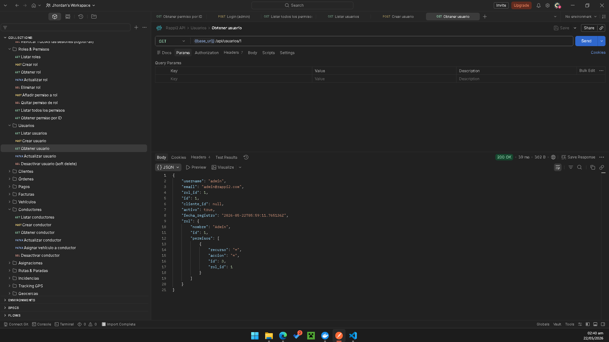

#### `PATCH` /api/usuarios/{usuario_id} — Actualizar usuario
- **Auth:** Bearer Token · Permiso: `usuarios:write`
- **Body (JSON):**
```json
{ "email": "nuevo@email.com", "rol_id": 1, "activo": true, "password": "nueva_clave" }
```

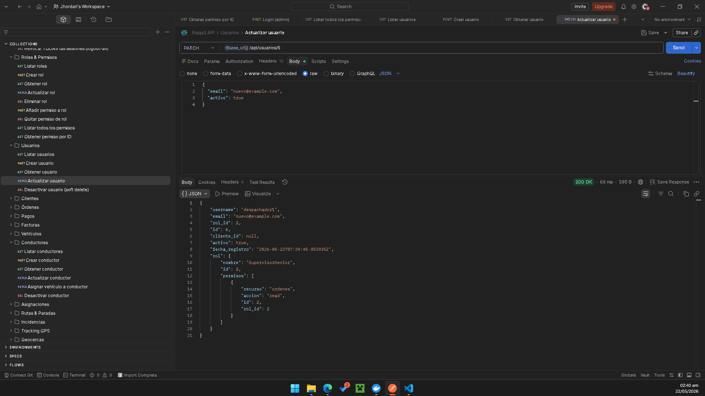

#### `DELETE` /api/usuarios/{usuario_id} — Desactivar usuario (soft delete)
- **Auth:** Bearer Token · Permiso: `usuarios:delete`
- **Response:** `204 No Content`

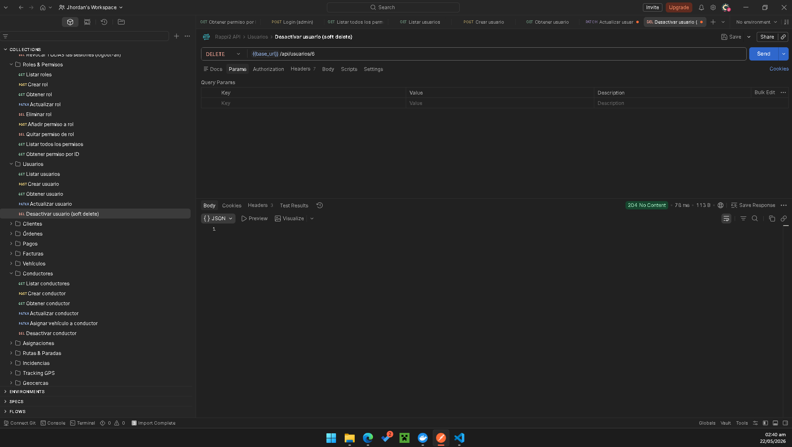

#### `POST` /api/usuarios/ — Crear usuario
- **Auth:** Bearer Token · Permiso: `usuarios:write`
- **Body (JSON):**
```json
{ "username": "string", "email": "user@example.com", "password": "string", "rol_id": 1, "cliente_id": null }
```

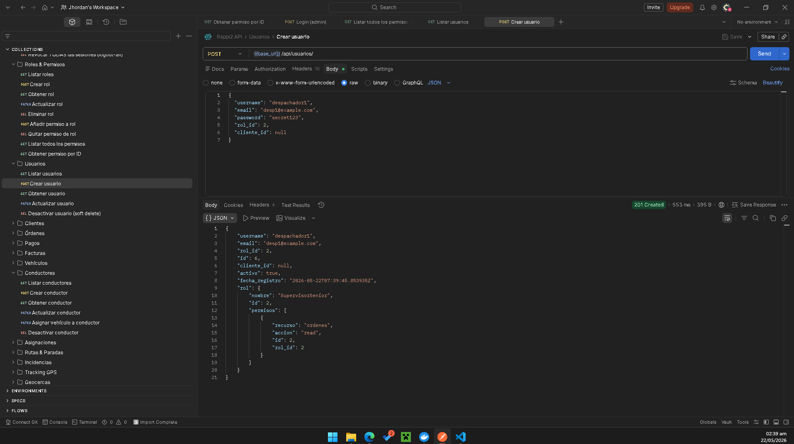

---

### Clientes

#### `GET` /api/clientes/ — Listar clientes
- **Auth:** Bearer Token · Permiso: `clientes:read`
- **Query params:** `skip` · `limit` · `activo`

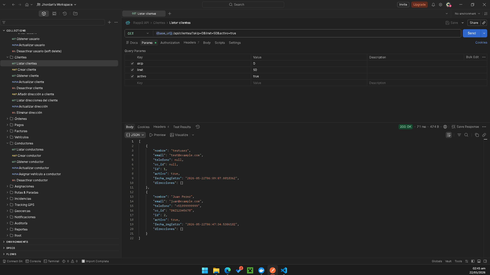

#### `POST` /api/clientes/ — Crear cliente
- **Auth:** Bearer Token · Permiso: `clientes:write`
- **Body (JSON):**
```json
{ "nombre": "string", "email": "cliente@email.com", "telefono": "999999999", "cc_id": "string" }
```


#### `GET` /api/clientes/{cliente_id} — Obtener cliente por ID
- **Auth:** Bearer Token · Permiso: `clientes:read`


#### `PATCH` /api/clientes/{cliente_id} — Actualizar cliente
- **Auth:** Bearer Token · Permiso: `clientes:write`
- **Body (JSON):**
```json
{ "nombre": "string", "email": "nuevo@email.com", "telefono": "string", "activo": true }
```


#### `DELETE` /api/clientes/{cliente_id} — Desactivar cliente (soft delete)
- **Auth:** Bearer Token · Permiso: `clientes:delete`
- **Response:** `204 No Content`

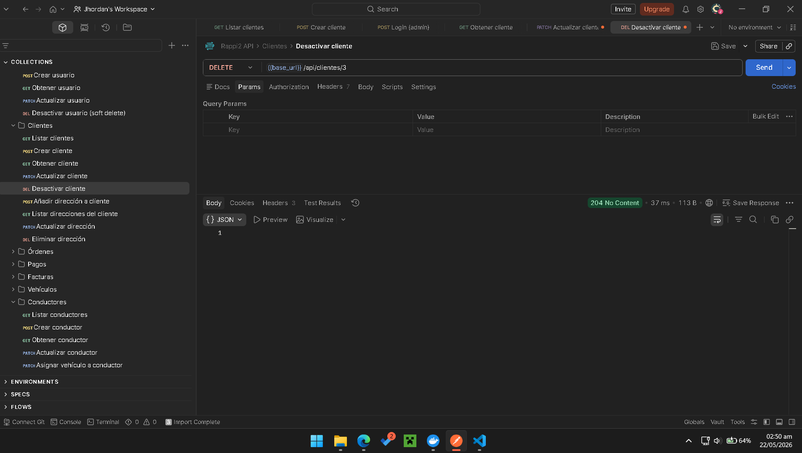

#### `GET` /api/clientes/{cliente_id}/direcciones — Listar direcciones de un cliente
- **Auth:** Bearer Token · Permiso: `clientes:read`


#### `POST` /api/clientes/{cliente_id}/direcciones — Agregar dirección
- **Auth:** Bearer Token · Permiso: `clientes:write`
- **Body (JSON):**
```json
{ "direccion": "Av. Ejemplo 123", "distrito": "Miraflores", "ciudad": "Lima", "pais": "PE", "es_principal": true }
```


#### `PATCH` /api/clientes/{cliente_id}/direcciones/{direccion_id} — Actualizar dirección
- **Auth:** Bearer Token · Permiso: `clientes:write`


#### `DELETE` /api/clientes/{cliente_id}/direcciones/{direccion_id} — Eliminar dirección
- **Auth:** Bearer Token · Permiso: `clientes:write`
- **Response:** `204 No Content`

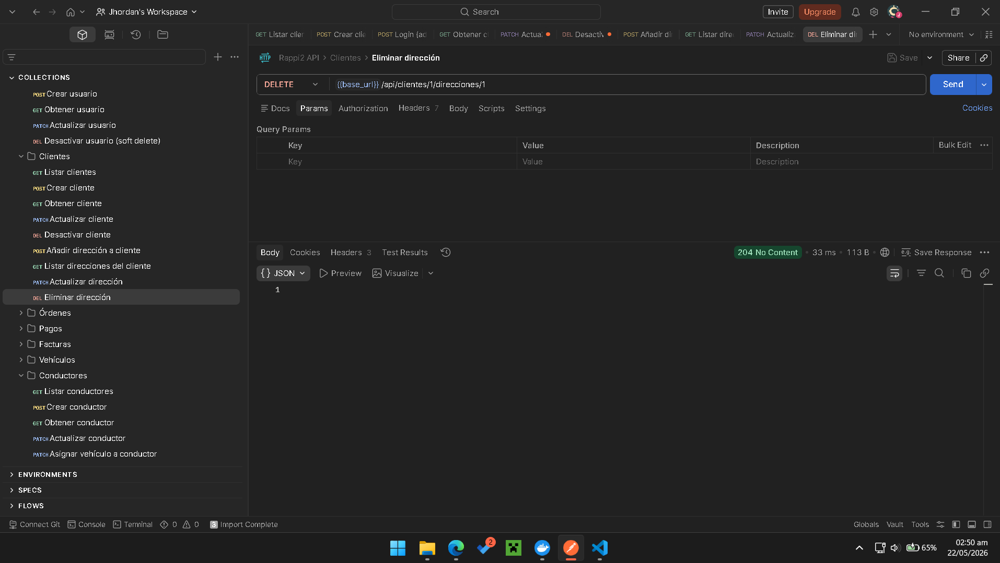

---

### Conductores

#### `GET` /api/conductores/ — Listar conductores
- **Auth:** Bearer Token · Permiso: `conductores:read`
- **Query params:** `skip` · `limit` · `activo` · `disponibilidad`

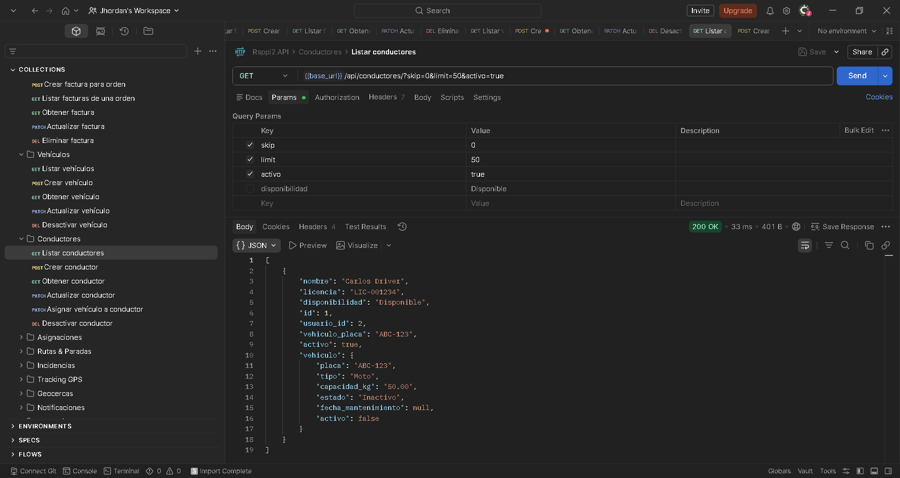

#### `POST` /api/conductores/ — Crear conductor
- **Auth:** Bearer Token · Permiso: `conductores:write`
- **Body (JSON):**
```json
{ "nombre": "string", "licencia": "ABC-123", "disponibilidad": "Disponible", "usuario_id": 1, "vehiculo_placa": "XYZ-999" }
```


#### `GET` /api/conductores/{conductor_id} — Obtener conductor por ID
- **Auth:** Bearer Token · Permiso: `conductores:read`


#### `PATCH` /api/conductores/{conductor_id} — Actualizar conductor
- **Auth:** Bearer Token · Permiso: `conductores:write`
- **Body (JSON):**
```json
{ "nombre": "string", "disponibilidad": "Disponible", "vehiculo_placa": "XYZ-999" }
```


#### `DELETE` /api/conductores/{conductor_id} — Desactivar conductor (soft delete)
- **Auth:** Bearer Token · Permiso: `conductores:delete`
- **Response:** `204 No Content`


#### `PATCH` /api/conductores/{conductor_id}/vehiculo — Asignar/cambiar vehículo
- **Auth:** Bearer Token · Permiso: `conductores:write`
- **Body (JSON):**
```json
{ "vehiculo_placa": "XYZ-999" }
```

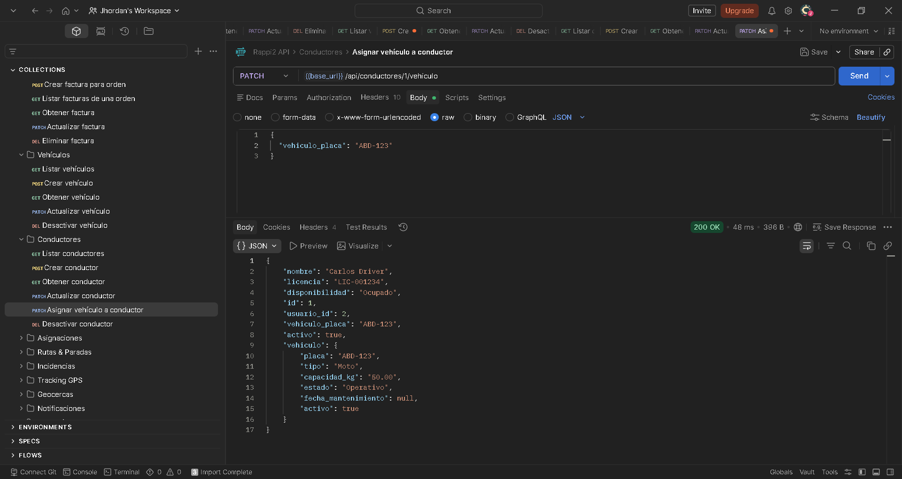

---

### Vehiculos

#### `GET` /api/vehiculos/ — Listar vehículos
- **Auth:** Bearer Token · Permiso: `vehiculos:read`
- **Query params:** `skip` · `limit` · `activo` · `estado`


#### `POST` /api/vehiculos/ — Crear vehículo
- **Auth:** Bearer Token · Permiso: `vehiculos:write`
- **Body (JSON):**
```json
{ "placa": "ABC-123", "tipo": "Camioneta", "capacidad_kg": 1500.0, "estado": "Operativo" }
```

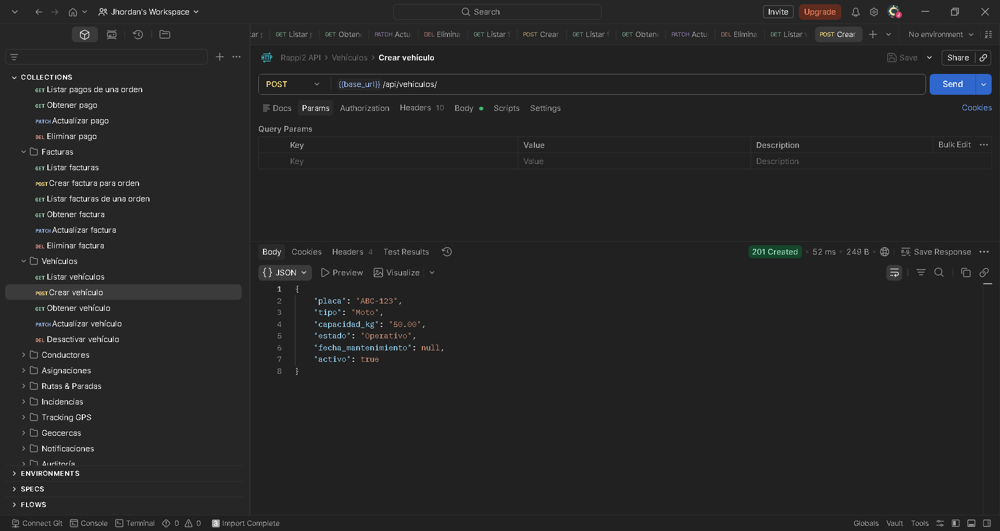

#### `GET` /api/vehiculos/{placa} — Obtener vehículo por placa
- **Auth:** Bearer Token · Permiso: `vehiculos:read`


#### `PATCH` /api/vehiculos/{placa} — Actualizar vehículo
- **Auth:** Bearer Token · Permiso: `vehiculos:write`
- **Body (JSON):**
```json
{ "tipo": "string", "capacidad_kg": 2000.0, "estado": "En Mantenimiento" }
```


#### `DELETE` /api/vehiculos/{placa} — Desactivar vehículo (soft delete)
- **Auth:** Bearer Token · Permiso: `vehiculos:delete`
- **Response:** `204 No Content`

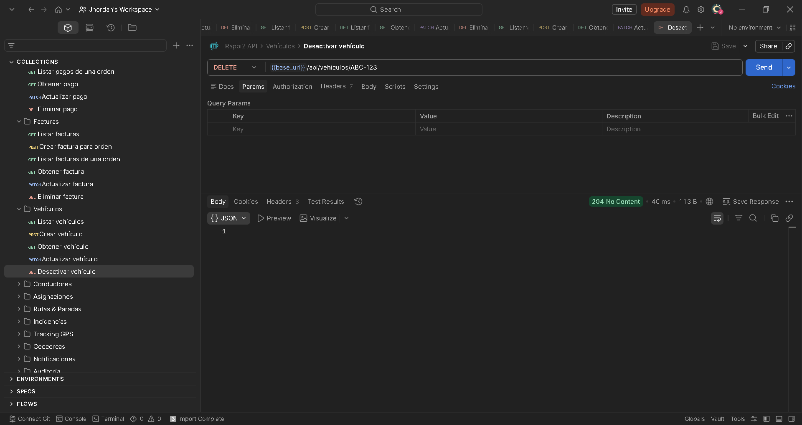

---

### Ordenes

#### `GET` /api/ordenes/ — Listar órdenes
- **Auth:** Bearer Token · Permiso: `ordenes:read`
- **Query params:** `skip` · `limit` · `cliente_id` · `estado`

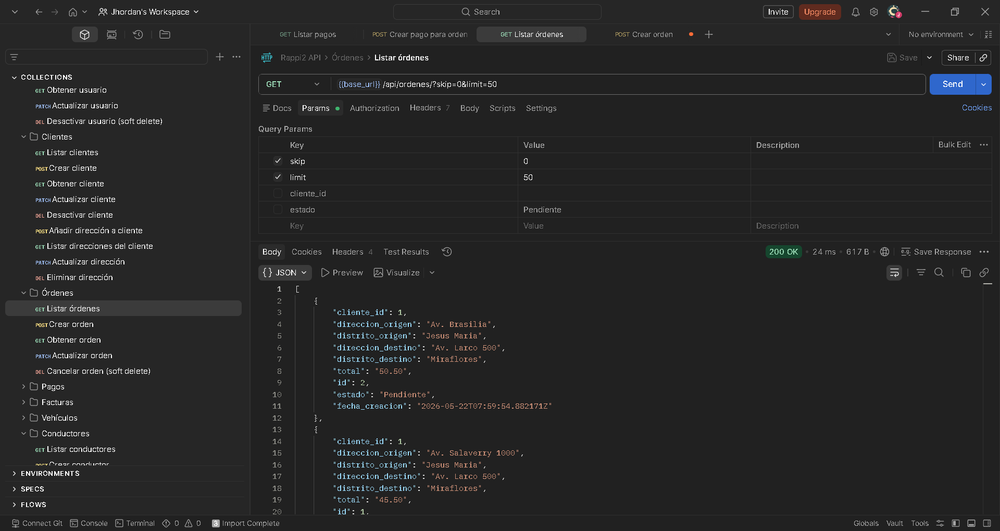

#### `POST` /api/ordenes/ — Crear orden
- **Auth:** Bearer Token · Permiso: `ordenes:write`
- **Body (JSON):**
```json
{
  "cliente_id": 1,
  "direccion_origen": "Av. Origen 100",
  "distrito_origen": "SJL",
  "direccion_destino": "Calle Destino 200",
  "distrito_destino": "Miraflores",
  "total": 150.00
}
```


#### `GET` /api/ordenes/{orden_id} — Obtener orden por ID
- **Auth:** Bearer Token · Permiso: `ordenes:read`


#### `PATCH` /api/ordenes/{orden_id} — Actualizar orden
- **Auth:** Bearer Token · Permiso: `ordenes:write`
- **Body (JSON):**
```json
{ "estado": "En Proceso", "direccion_destino": "Nueva dirección", "total": 200.00 }
```

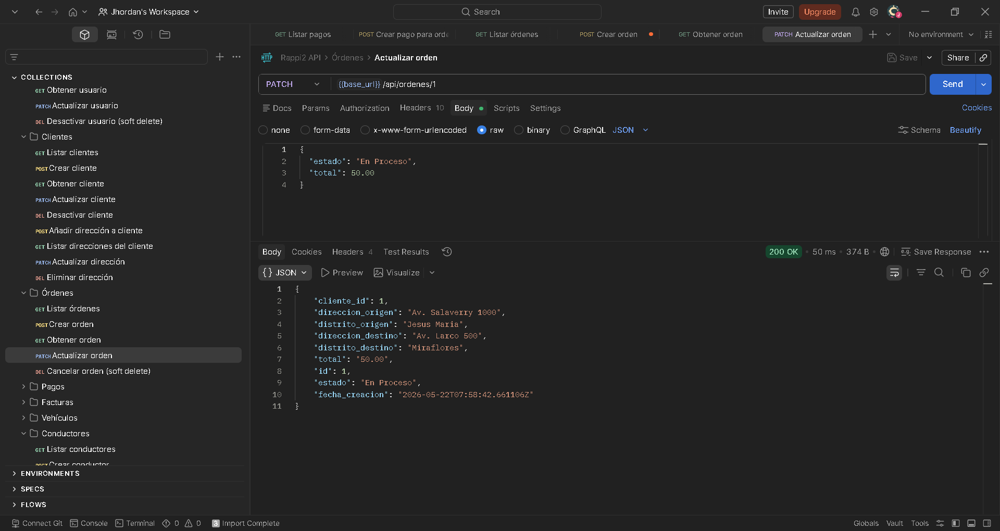

#### `DELETE` /api/ordenes/{orden_id} — Cancelar orden (cambia estado a "Cancelado")
- **Auth:** Bearer Token · Permiso: `ordenes:delete`
- **Response:** `204 No Content`

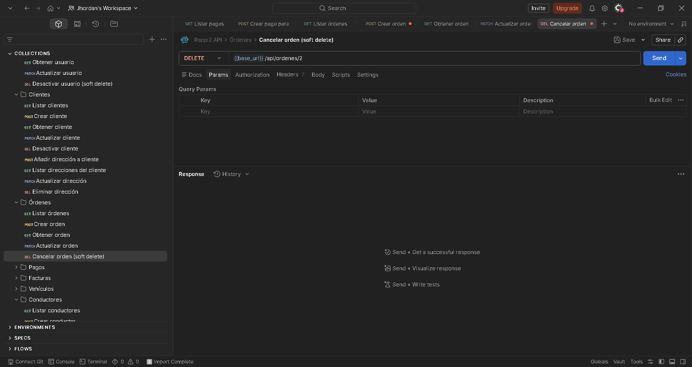

#### `GET` /api/ordenes/{orden_id}/pagos — Listar pagos de una orden
- **Auth:** Bearer Token · Permiso: `pagos:read`


#### `GET` /api/ordenes/{orden_id}/facturas — Listar facturas de una orden
- **Auth:** Bearer Token · Permiso: `facturas:read`


---

### Pagos

#### `GET` /api/pagos — Listar todos los pagos
- **Auth:** Bearer Token · Permiso: `pagos:read`
- **Query params:** `skip` · `limit` · `estado` · `desde` · `hasta`

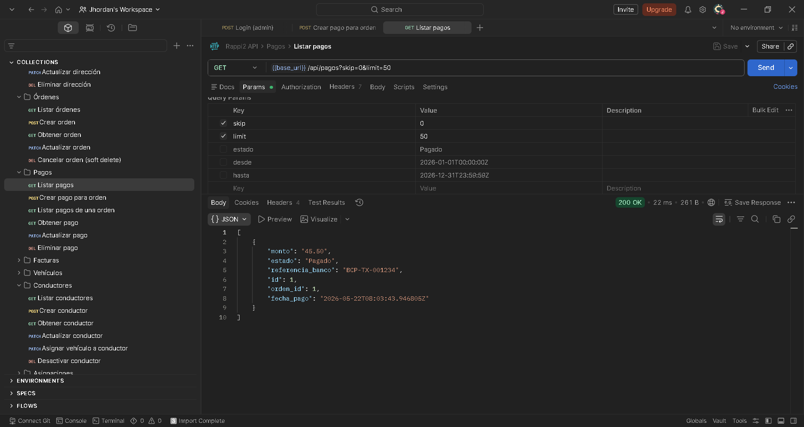

#### `POST` /api/ordenes/{orden_id}/pagos — Registrar pago para una orden
- **Auth:** Bearer Token · Permiso: `pagos:write`
- **Body (JSON):**
```json
{ "monto": 150.00, "estado": "Pendiente", "referencia_banco": "REF-001" }
```


#### `GET` /api/pagos/{pago_id} — Obtener pago por ID
- **Auth:** Bearer Token · Permiso: `pagos:read`


#### `PATCH` /api/pagos/{pago_id} — Actualizar pago
- **Auth:** Bearer Token · Permiso: `pagos:write`
- **Body (JSON):**
```json
{ "estado": "Pagado", "referencia_banco": "REF-002" }
```

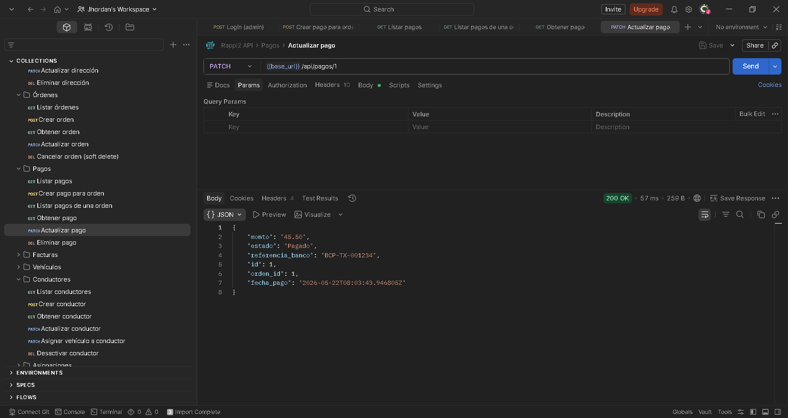

#### `DELETE` /api/pagos/{pago_id} — Eliminar pago
- **Auth:** Bearer Token · Permiso: `pagos:delete`
- **Response:** `204 No Content`


---

### Facturas

#### `GET` /api/facturas — Listar todas las facturas
- **Auth:** Bearer Token · Permiso: `facturas:read`
- **Query params:** `skip` · `limit` · `ruc` · `desde` · `hasta`

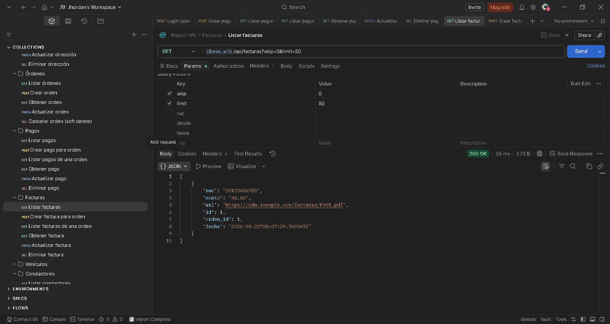

#### `POST` /api/ordenes/{orden_id}/facturas — Crear factura para una orden
- **Auth:** Bearer Token · Permiso: `facturas:write`
- **Body (JSON):**
```json
{ "ruc": "20123456789", "monto": 150.00, "url": "https://factura.pdf" }
```

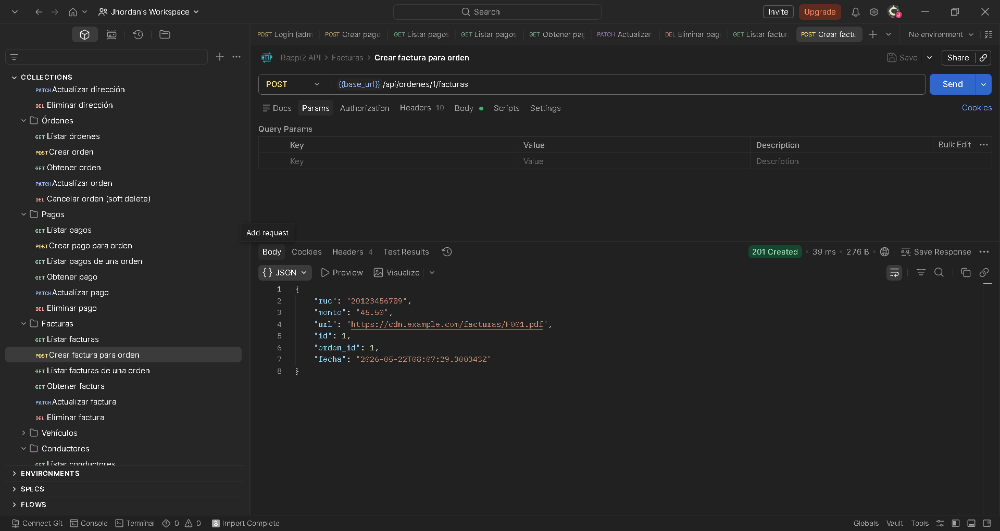

#### `GET` /api/facturas/{factura_id} — Obtener factura por ID
- **Auth:** Bearer Token · Permiso: `facturas:read`

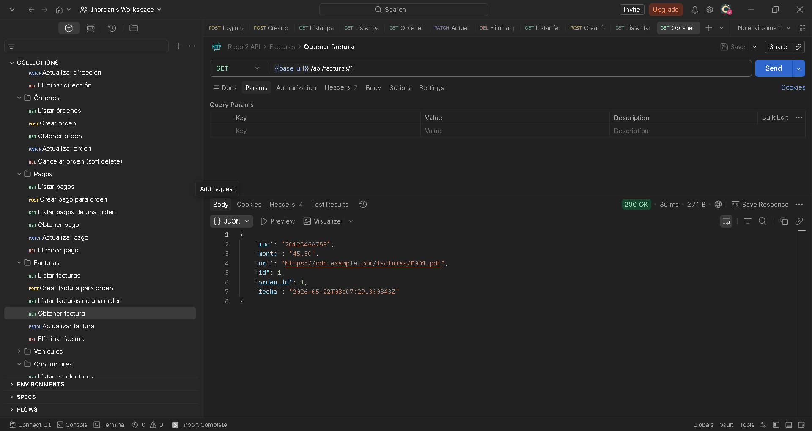

#### `PATCH` /api/facturas/{factura_id} — Actualizar factura
- **Auth:** Bearer Token · Permiso: `facturas:write`
- **Body (JSON):**
```json
{ "ruc": "20123456789", "monto": 200.00, "url": "https://nueva-factura.pdf" }
```

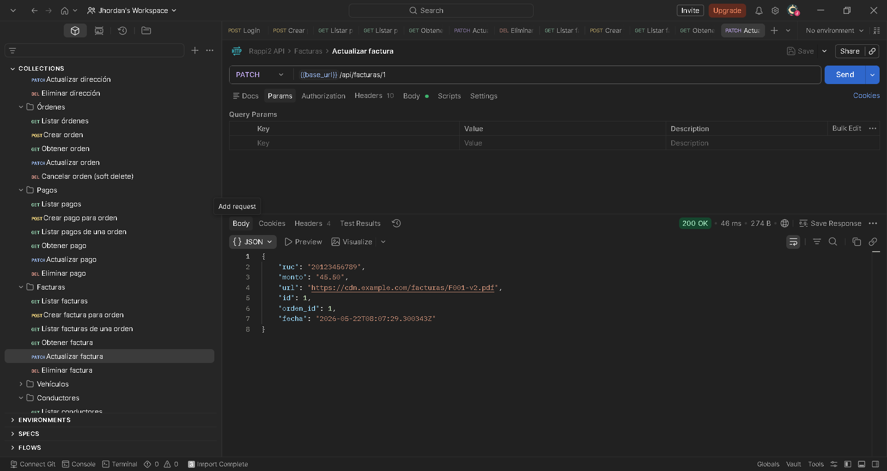

#### `DELETE` /api/facturas/{factura_id} — Eliminar factura
- **Auth:** Bearer Token · Permiso: `facturas:delete`
- **Response:** `204 No Content`

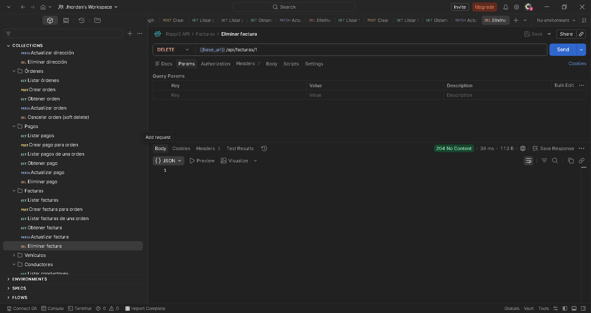

---

### Root / Docs

#### `GET` / — Información del servicio
- **Auth:** No requiere

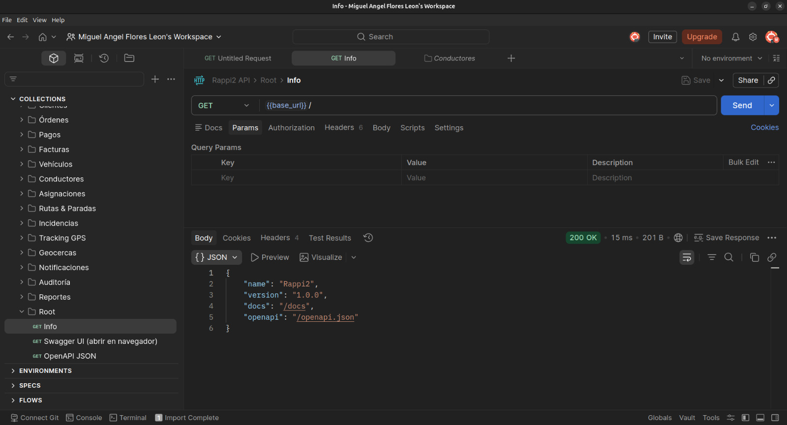

#### `GET` /docs — Swagger UI (documentación interactiva)
- **Auth:** No requiere

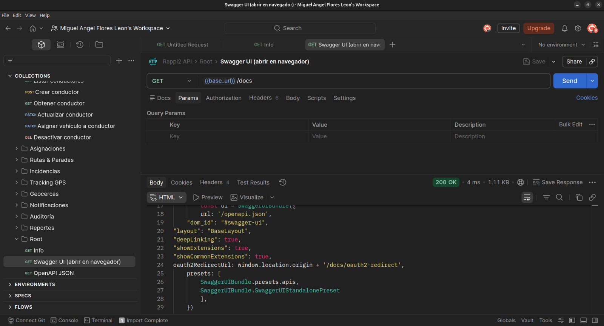

#### `GET` /openapi.json — Esquema OpenAPI
- **Auth:** No requiere

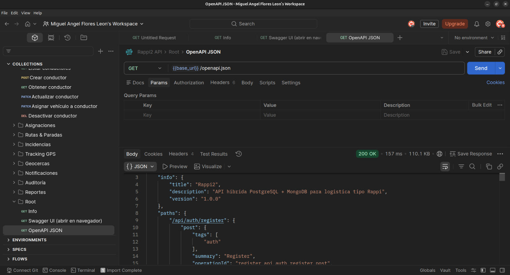

---

### Asignaciones

#### `GET` /api/asignaciones/ — Listar asignaciones
- **Auth:** Bearer Token · Permiso: `asignaciones:read`
- **Query params:** `skip` · `limit` · `estado` · `conductor_id`


#### `GET` /api/asignaciones/{asignacion_id} — Obtener asignación por ID
- **Auth:** Bearer Token · Permiso: `asignaciones:read`


#### `POST` /api/asignaciones/ — Crear asignación
- **Auth:** Bearer Token · Permiso: `asignaciones:write`
- **Body (JSON):**
```json
{ "orden_id": 1, "conductor_id": 1, "vehiculo_placa": "ABC-123" }
```

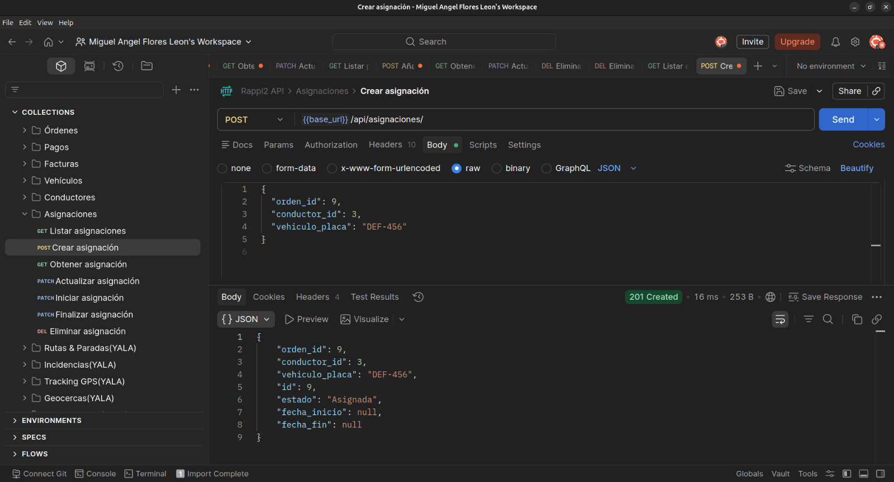

#### `PATCH` /api/asignaciones/{asignacion_id} — Actualizar asignación
- **Auth:** Bearer Token · Permiso: `asignaciones:write`
- **Body (JSON):**
```json
{ "estado": "Asignada", "fecha_inicio": null, "fecha_fin": null }
```

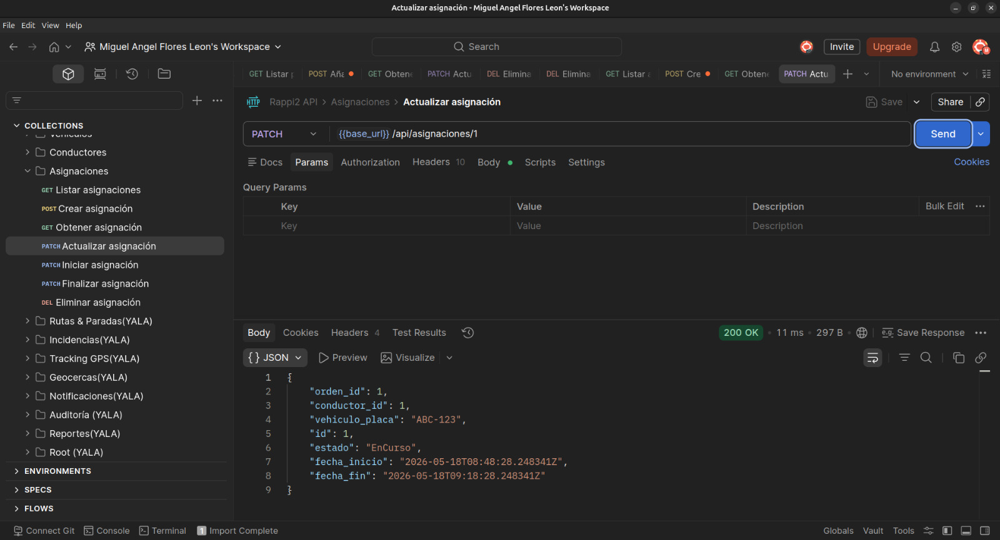

#### `PATCH` /api/asignaciones/{asignacion_id}/iniciar — Iniciar asignación
- **Auth:** Bearer Token · Permiso: `asignaciones:write`
- **Body:** No requiere (cambia estado a "EnCurso" y orden a "En Tránsito")


#### `PATCH` /api/asignaciones/{asignacion_id}/finalizar — Finalizar asignación
- **Auth:** Bearer Token · Permiso: `asignaciones:write`
- **Body:** No requiere (cambia estado a "Finalizada" y orden a "Entregado")

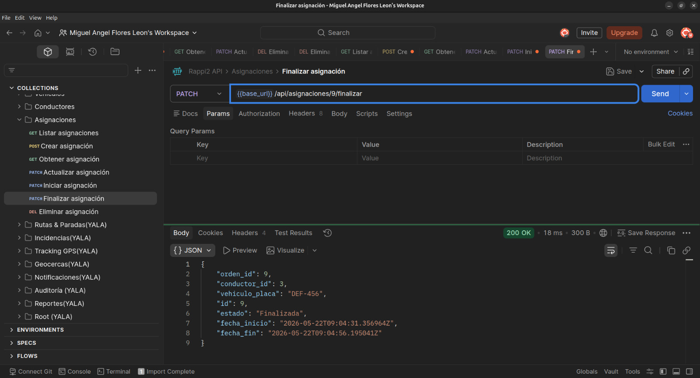

#### `DELETE` /api/asignaciones/{asignacion_id} — Eliminar asignación
- **Auth:** Bearer Token · Permiso: `asignaciones:delete`
- **Response:** `204 No Content`

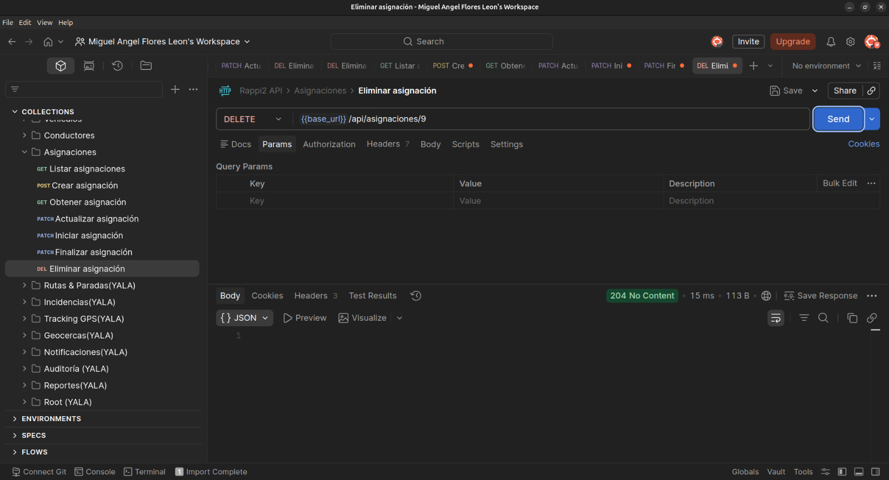

---

### Auditoría

#### `GET` /api/auditoria/ — Listar logs de auditoría
- **Auth:** Bearer Token · Permiso: `auditoria:read`
- **Query params:** `usuario_id` · `metodo` · `skip` · `limit`

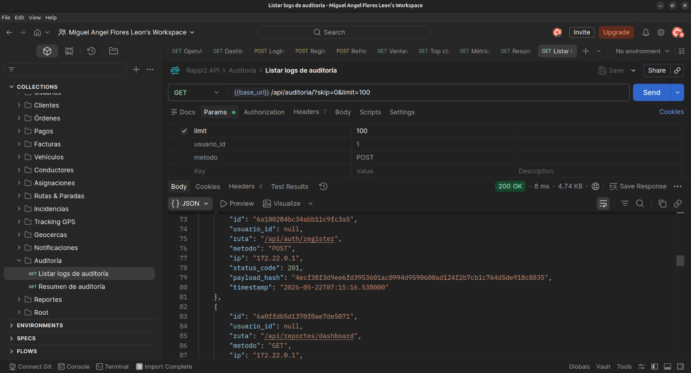

#### `GET` /api/auditoria/resumen — Resumen agregado de auditoría
- **Auth:** Bearer Token · Permiso: `auditoria:read`
- **Query params:** `horas` (ventana en horas, 1–720)

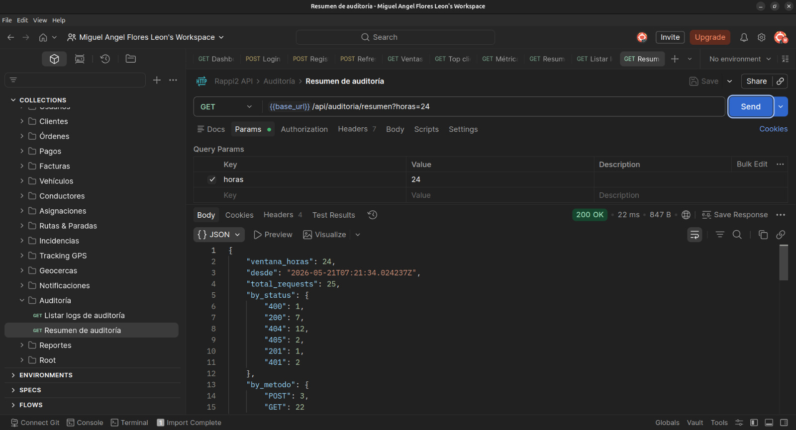

---

### Geocercas

#### `GET` /api/geocercas — Listar geocercas
- **Auth:** Bearer Token · Permiso: `geocercas:read`
- **Query params:** `ruta_id` · `activa`


#### `GET` /api/geocercas/{geocerca_id} — Obtener geocerca por ID
- **Auth:** Bearer Token · Permiso: `geocercas:read`


#### `POST` /api/geocercas — Crear geocerca
- **Auth:** Bearer Token · Permiso: `geocercas:write`
- **Body (JSON):**
```json
{ "ruta_id": 1, "orden_id": 1, "tipo": "zona_entrega", "coordinates": [[[-77.0, -12.0], [-77.1, -12.0], [-77.1, -12.1], [-77.0, -12.0]]], "activa": true }
```

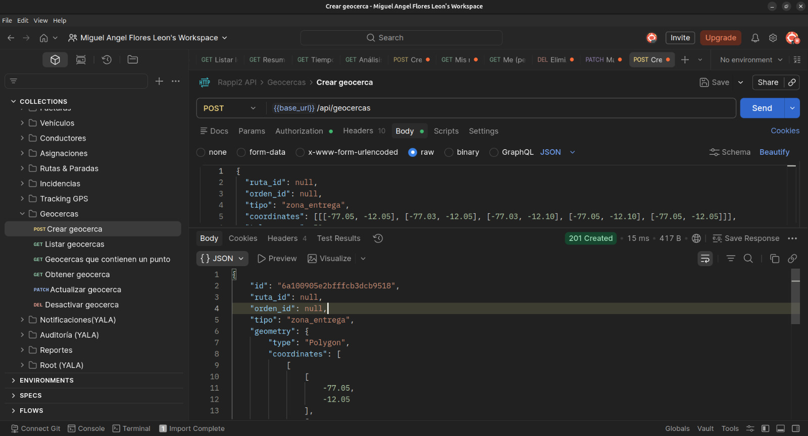

#### `PATCH` /api/geocercas/{geocerca_id} — Actualizar geocerca
- **Auth:** Bearer Token · Permiso: `geocercas:write`
- **Body (JSON):**
```json
{ "tipo": "almacen", "activa": false }
```

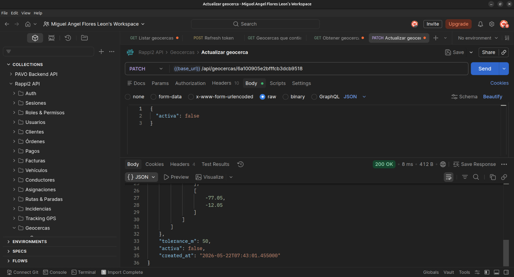

#### `DELETE` /api/geocercas/{geocerca_id} — Desactivar geocerca
- **Auth:** Bearer Token · Permiso: `geocercas:delete`
- **Response:** `204 No Content`


#### `GET` /api/geocercas/contiene?lon={lon}&lat={lat} — Geocercas que contienen un punto
- **Auth:** Bearer Token · Permiso: `geocercas:read`
- **Query params (obligatorios):** `lon` · `lat`

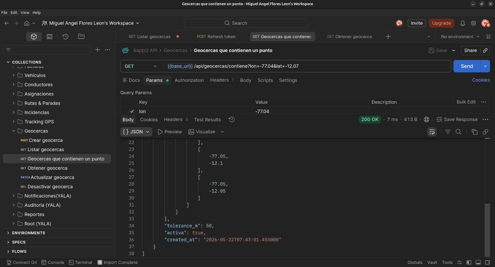

---

### Incidencias (CRUD)

#### `GET` /api/incidencias/ — Listar incidencias
- **Auth:** Bearer Token · Permiso: `incidencias:read`
- **Query params:** `skip` · `limit` · `asignacion_id` · `severidad_min`


#### `GET` /api/incidencias/{incidencia_id} — Obtener incidencia por ID
- **Auth:** Bearer Token · Permiso: `incidencias:read`


#### `POST` /api/incidencias/ — Crear incidencia
- **Auth:** Bearer Token · Permiso: `incidencias:write`
- **Body (JSON):**
```json
{ "asignacion_id": 1, "tipo": "Retraso", "severidad": 3, "notas": "Descripción del problema" }
```


#### `PATCH` /api/incidencias/{incidencia_id} — Actualizar incidencia
- **Auth:** Bearer Token · Permiso: `incidencias:write`
- **Body (JSON):**
```json
{ "tipo": "Daño", "severidad": 5, "notas": "Actualización" }
```


#### `DELETE` /api/incidencias/{incidencia_id} — Eliminar incidencia
- **Auth:** Bearer Token · Permiso: `incidencias:delete`
- **Response:** `204 No Content`


---

### Incidencias (Evidencias)

#### `GET` /api/incidencias/{incidencia_id}/evidencias — Listar evidencias de una incidencia
- **Auth:** Bearer Token · Permiso: `incidencias:read`


#### `GET` /api/incidencias/evidencias/{evidencia_id} — Obtener evidencia por ID
- **Auth:** Bearer Token · Permiso: `incidencias:read`

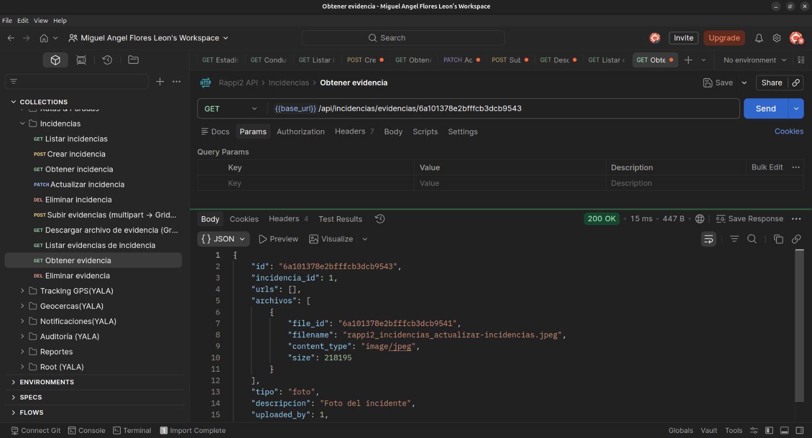

#### `POST` /api/incidencias/{incidencia_id}/evidencias/upload — Subir evidencia (multipart)
- **Auth:** Bearer Token · Permiso: `incidencias:write`
- **Content-Type:** `multipart/form-data`
- **Form fields:** `tipo` (foto/video/audio/documento) · `descripcion` · `archivos` (files)

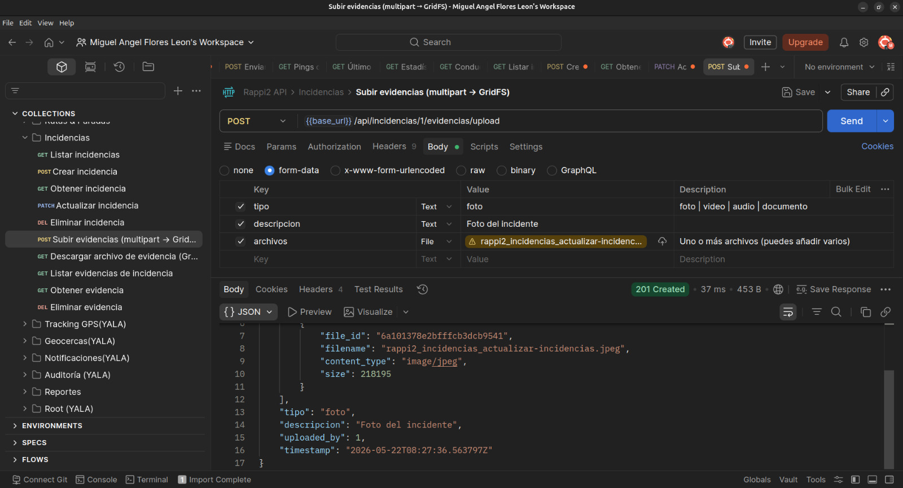

#### `GET` /api/incidencias/evidencias/archivos/{file_id} — Descargar archivo de evidencia
- **Auth:** Bearer Token · Permiso: `incidencias:read`

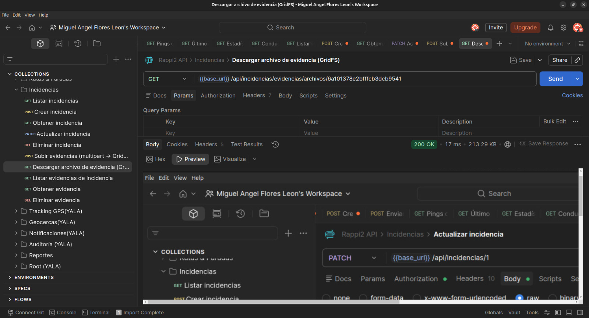

#### `DELETE` /api/incidencias/evidencias/{evidencia_id} — Eliminar evidencia
- **Auth:** Bearer Token · Permiso: `incidencias:delete`
- **Response:** `204 No Content`

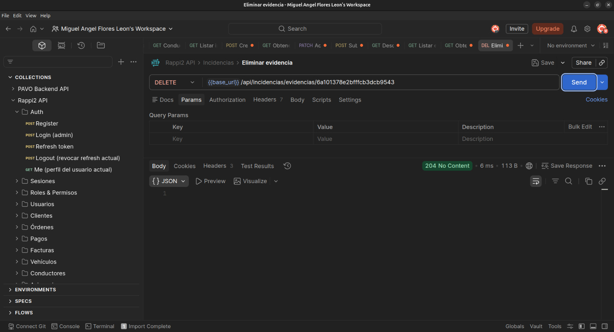

---

### Notificaciones

#### `GET` /api/notificaciones/mias — Mis notificaciones
- **Auth:** Bearer Token (usuario autenticado)
- **Query params:** `leida` (bool) · `skip` · `limit`


#### `POST` /api/notificaciones/ — Crear notificación
- **Auth:** Bearer Token · Permiso: `notificaciones:write`
- **Body (JSON):**
```json
{
  "destinatario_tipo": "cliente",
  "destinatario_id": 1,
  "tipo": "orden_actualizada",
  "titulo": "Tu orden fue enviada",
  "mensaje": "El conductor está en camino",
  "metadata": {}
}
```


#### `PATCH` /api/notificaciones/{notif_id}/leer — Marcar notificación como leída
- **Auth:** Bearer Token (usuario autenticado)
- **Body:** No requiere


#### `DELETE` /api/notificaciones/{notif_id} — Eliminar notificación
- **Auth:** Bearer Token (usuario autenticado)
- **Response:** `204 No Content`


---

### Tracking GPS

#### `POST` /api/tracking/ping — Enviar ping GPS
- **Auth:** Bearer Token · Permiso: `tracking:write`
- **Body (JSON):**
```json
{
  "asignacion_id": 1,
  "conductor_id": 1,
  "vehiculo_placa": "ABC-123",
  "lon": -77.0428,
  "lat": -12.0464,
  "speed_kmh": 35.5,
  "heading": 180.0,
  "accuracy_m": 5.0
}
```

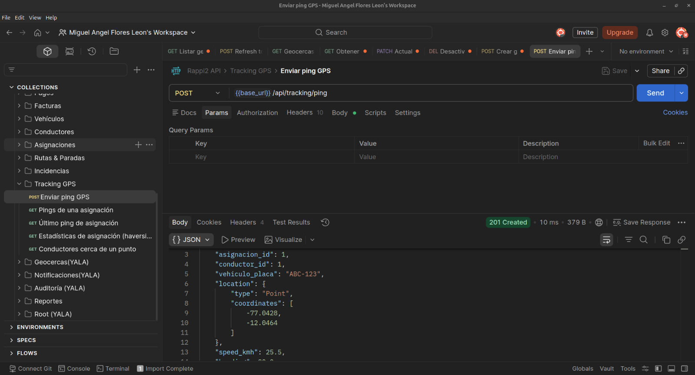

#### `GET` /api/tracking/asignacion/{asignacion_id} — Pings GPS de una asignación
- **Auth:** Bearer Token · Permiso: `tracking:read`
- **Query params:** `desde` · `hasta` · `limit`

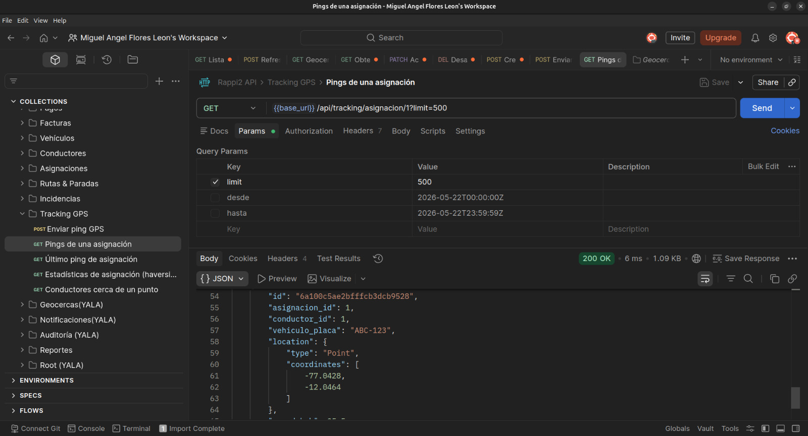

#### `GET` /api/tracking/asignacion/{asignacion_id}/ultimo — Último ping de una asignación
- **Auth:** Bearer Token · Permiso: `tracking:read`


#### `GET` /api/tracking/asignacion/{asignacion_id}/estadisticas — Estadísticas de recorrido
- **Auth:** Bearer Token · Permiso: `tracking:read`


#### `GET` /api/tracking/conductores-cerca — Conductores cercanos a un punto
- **Auth:** Bearer Token · Permiso: `tracking:read`
- **Query params (obligatorios):** `lon` · `lat`
- **Query params (opcionales):** `radio_m` (default: 2000) · `ventana_min` (default: 5)

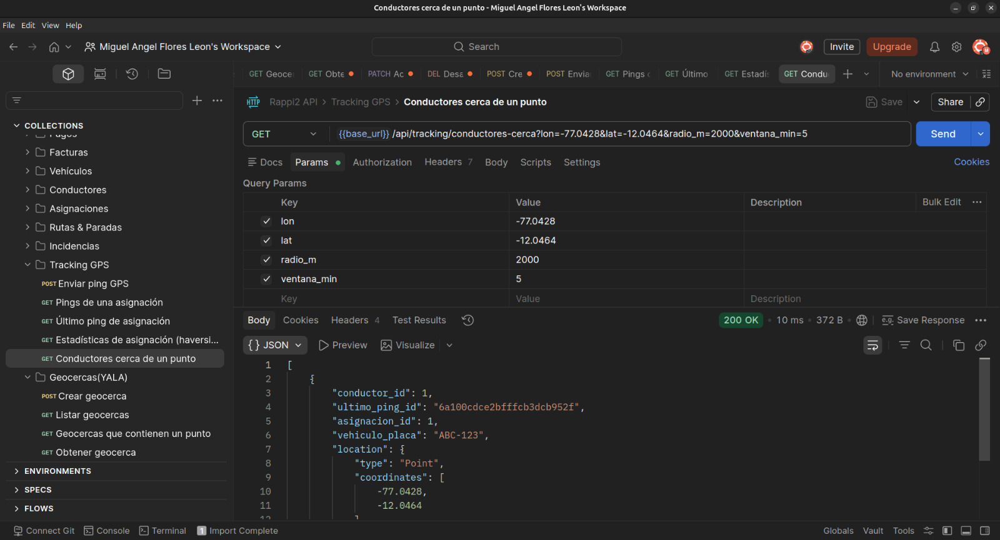

---

### Reportes / KPIs

#### `GET` /api/reportes/dashboard — Dashboard general (KPIs)
- **Auth:** Bearer Token · Permiso: `reportes:read`


#### `GET` /api/reportes/operativo — KPIs operativos en tiempo real
- **Auth:** Bearer Token · Permiso: `reportes:read`
- **Query params:** `ventana_minutos` (default: 5)

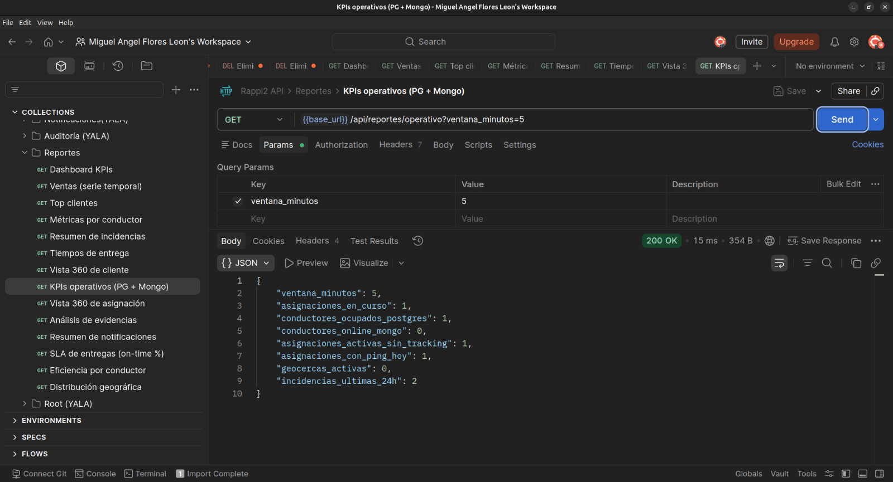

#### `GET` /api/reportes/sla-entregas — SLA de entregas
- **Auth:** Bearer Token · Permiso: `reportes:read`
- **Query params:** `desde` · `hasta` · `sla_minutos` (default: 60)

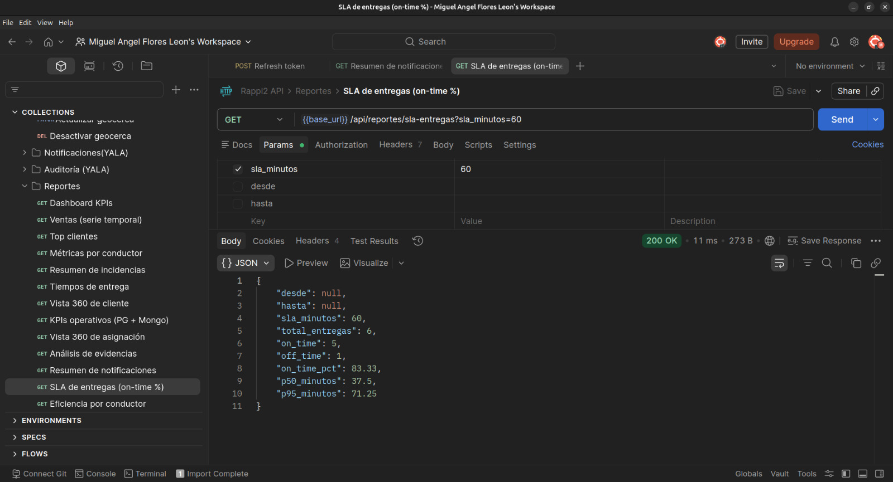

#### `GET` /api/reportes/tiempos-entrega — Tiempos de entrega (promedio, min, max)
- **Auth:** Bearer Token · Permiso: `reportes:read`
- **Query params:** `desde` · `hasta`


#### `GET` /api/reportes/ventas — Ventas (serie temporal)
- **Auth:** Bearer Token · Permiso: `reportes:read`
- **Query params:** `desde` · `hasta` · `granularidad` ("dia" | "mes")

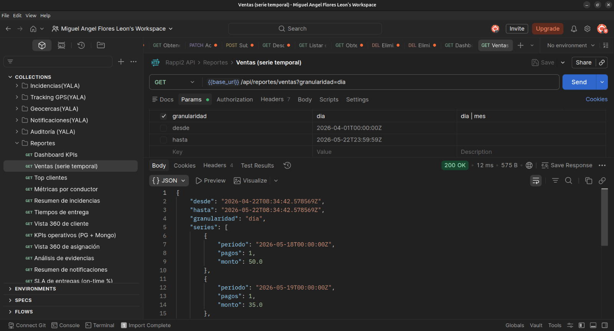

#### `GET` /api/reportes/top-clientes — Top clientes por recaudación
- **Auth:** Bearer Token · Permiso: `reportes:read`
- **Query params:** `limit` (default: 10)


#### `GET` /api/reportes/conductores/eficiencia — Eficiencia por conductor
- **Auth:** Bearer Token · Permiso: `reportes:read`
- **Query params:** `desde` · `hasta` · `limit`


#### `GET` /api/reportes/conductores — Métricas por conductor
- **Auth:** Bearer Token · Permiso: `reportes:read`

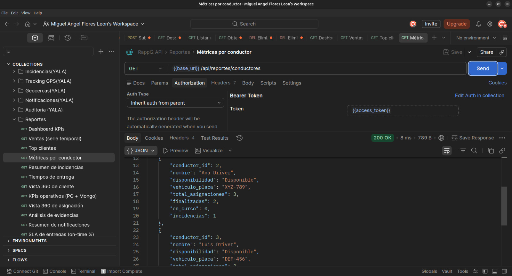

#### `GET` /api/reportes/incidencias — Resumen de incidencias
- **Auth:** Bearer Token · Permiso: `reportes:read`
- **Query params:** `desde` · `hasta`

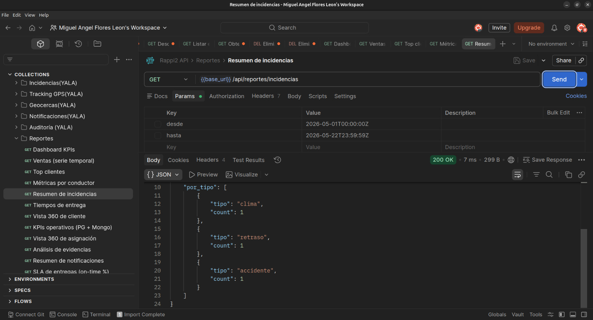

#### `GET` /api/reportes/notificaciones — Resumen de notificaciones
- **Auth:** Bearer Token · Permiso: `reportes:read`
- **Query params:** `horas` (ventana en horas, 1–720)

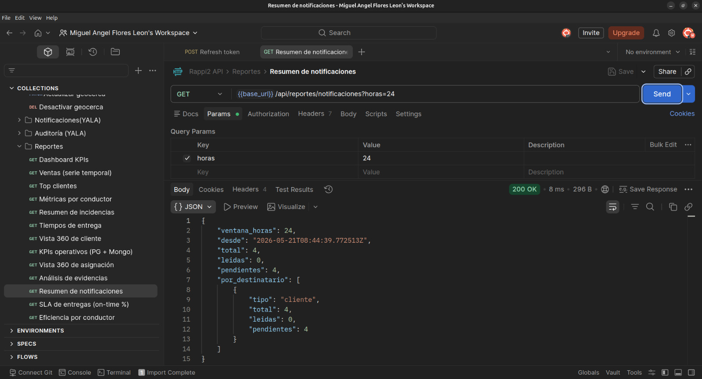

#### `GET` /api/reportes/evidencias — Análisis de evidencias
- **Auth:** Bearer Token · Permiso: `reportes:read`


#### `GET` /api/reportes/asignacion/{asignacion_id}/completo — Vista 360° de asignación
- **Auth:** Bearer Token · Permiso: `reportes:read`

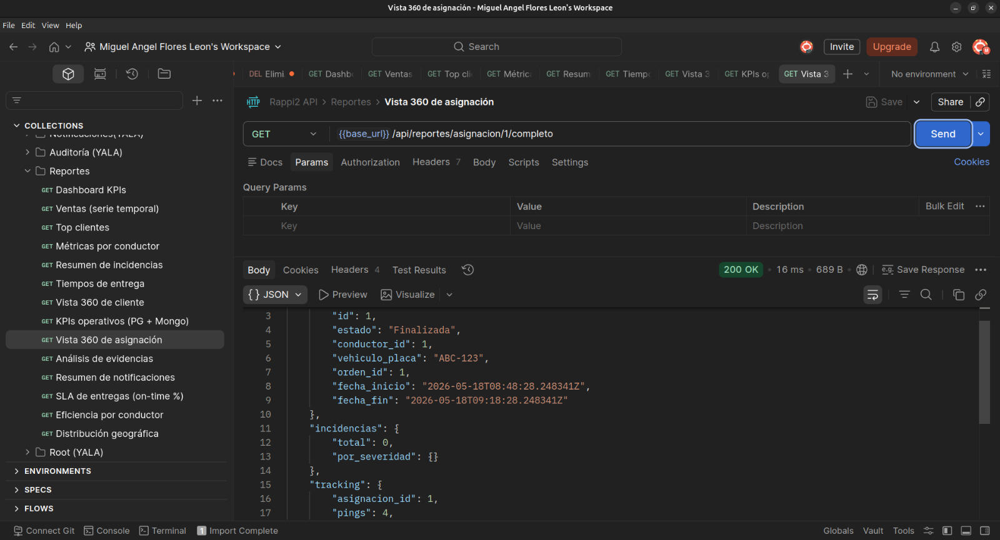

#### `GET` /api/reportes/cliente/{cliente_id}/resumen — Vista 360° de cliente
- **Auth:** Bearer Token · Permiso: `reportes:read`

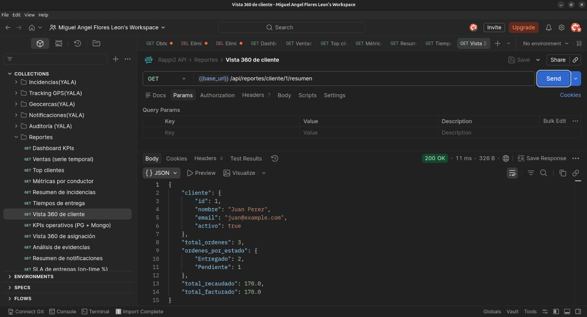

---

### Rutas y Paradas

#### `POST` /api/rutas/planificar — Planificar ruta con OpenRouteService
- **Auth:** Bearer Token · Permiso: `rutas:write`
- **Body (JSON):**
```json
{
  "orden_id": 1,
  "origen_lon": -77.0428, "origen_lat": -12.0464,
  "destino_lon": -77.0300, "destino_lat": -12.1200,
  "generar_geocerca": true,
  "tolerancia_metros": 50
}
```

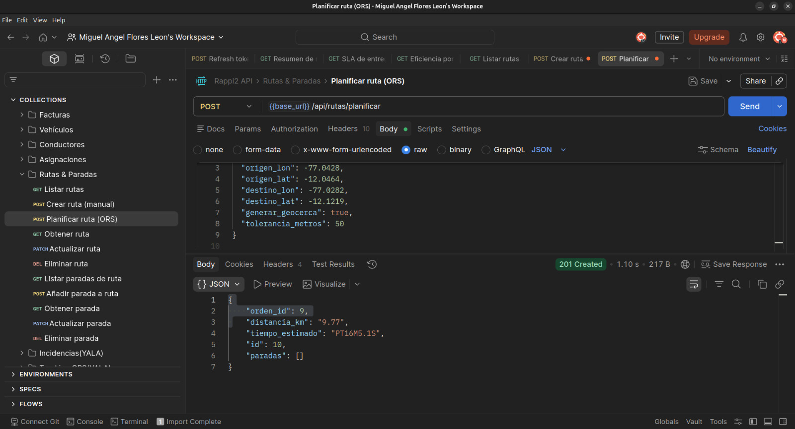

#### `GET` /api/rutas/ — Listar rutas planificadas
- **Auth:** Bearer Token · Permiso: `rutas:read`
- **Query params:** `orden_id`

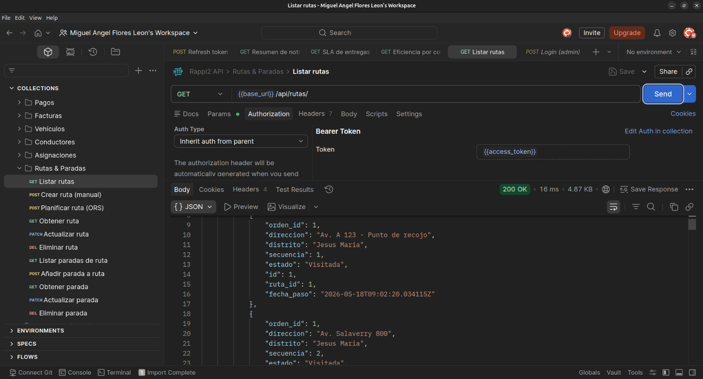

#### `GET` /api/rutas/{ruta_id} — Obtener ruta por ID
- **Auth:** Bearer Token · Permiso: `rutas:read`


#### `POST` /api/rutas/ — Crear ruta manualmente
- **Auth:** Bearer Token · Permiso: `rutas:write`
- **Body (JSON):**
```json
{ "orden_id": 1, "distancia_km": 15.5, "tiempo_estimado": "00:45:00", "paradas": [] }
```


#### `PATCH` /api/rutas/{ruta_id} — Actualizar ruta
- **Auth:** Bearer Token · Permiso: `rutas:write`
- **Body (JSON):**
```json
{ "distancia_km": 20.0, "tiempo_estimado": "01:00:00" }
```

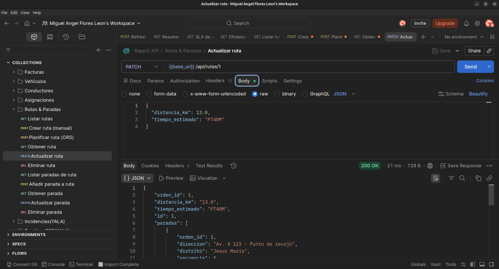

#### `DELETE` /api/rutas/{ruta_id} — Eliminar ruta
- **Auth:** Bearer Token · Permiso: `rutas:delete`
- **Response:** `204 No Content`


#### `GET` /api/rutas/{ruta_id}/paradas — Listar paradas de una ruta
- **Auth:** Bearer Token · Permiso: `rutas:read`


#### `GET` /api/rutas/{ruta_id}/paradas/{parada_id} — Obtener parada por ID
- **Auth:** Bearer Token · Permiso: `rutas:read`

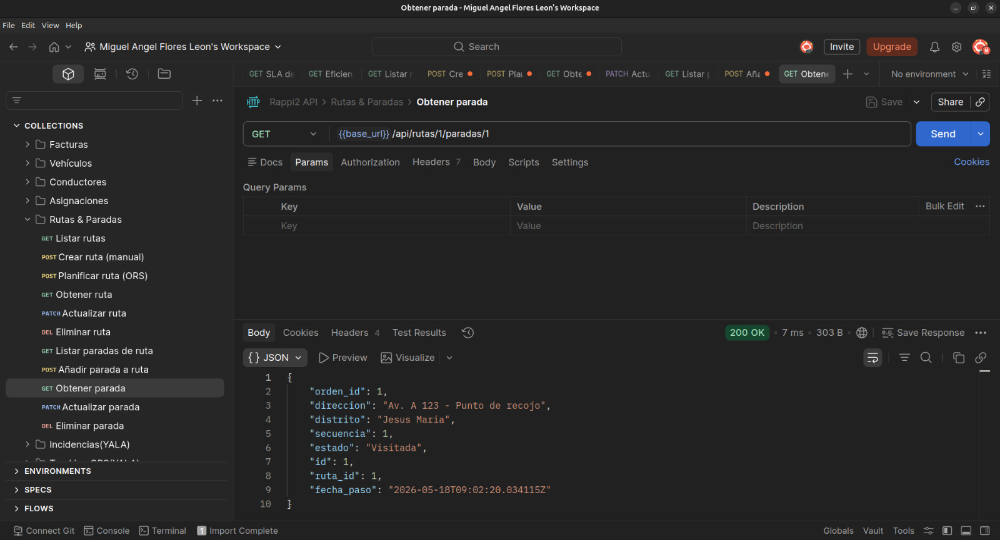

#### `POST` /api/rutas/{ruta_id}/paradas — Agregar parada a una ruta
- **Auth:** Bearer Token · Permiso: `rutas:write`
- **Body (JSON):**
```json
{ "orden_id": 1, "direccion": "Av. Parada 300", "distrito": "Surco", "secuencia": 1, "estado": "Pendiente" }
```


#### `PATCH` /api/rutas/{ruta_id}/paradas/{parada_id} — Actualizar parada
- **Auth:** Bearer Token · Permiso: `rutas:write`
- **Body (JSON):**
```json
{ "estado": "Completada", "direccion": "Nueva dirección" }
```

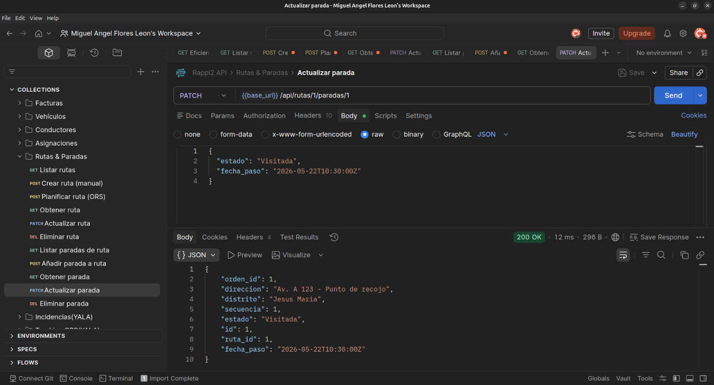

#### `DELETE` /api/rutas/{ruta_id}/paradas/{parada_id} — Eliminar parada
- **Auth:** Bearer Token · Permiso: `rutas:write`
- **Response:** `204 No Content`

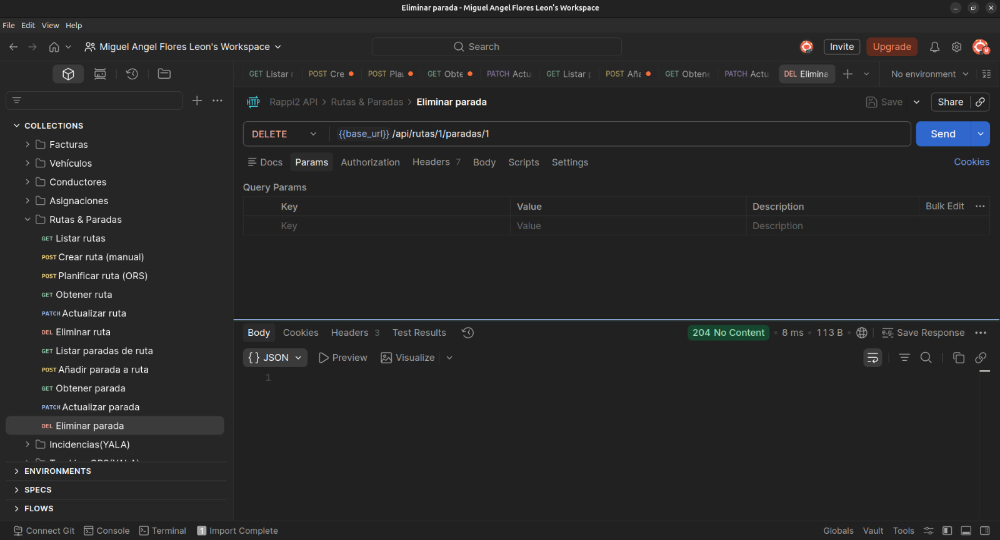

---
