# Rappi2 — Plataforma de Logística (FastAPI + PostgreSQL + MongoDB + React)

> Plataforma full-stack de logística y *delivery* ambientada en **Arequipa, Perú**: el cliente
> crea y **paga** su envío, lo **rastrea en vivo**, el conductor lo entrega desde una **PWA móvil**
> y el equipo interno **despacha, asigna y mide** todo desde un panel con KPIs.

<p>
  
  
  
  
  
  
</p>

## ¿Qué hace? (funciones de un vistazo)

- 🔐 **Auth + RBAC**: autenticación con **Keycloak (OIDC, Authorization Code + PKCE)**; el backend valida el token (no emite JWT propios) y deriva permisos `(recurso, acción)` —con comodín `*`— del rol del token.
- 🧑‍🤝‍🧑 **4 experiencias por rol** en la misma SPA: **Cliente**, **Conductor (PWA)**, **Despachador** y **Administrador**.
- 📦 **Ciclo de orden**: crear → **cotizar precio** (server-side) → **pagar (MercadoPago Checkout Pro / modo simulado)** → asignar → entregar (multidestino, entregas parciales, *run* agrupado).
- 🧭 **Ruteo por calles con OSRM**: geometría, distancia y tiempo reales; geocerca de corredor automática.
- 📍 **Tracking GPS en tiempo real (SSE + Redis)**: el conductor envía pings, el cliente ve moverse al conductor en vivo; detección de **desvío de ruta**.
- 🗺️ **Geocercas** (zonas/corredores, `$geoNear`, punto-en-polígono) y **geocoding** inverso/directo.
- 🧾 **Pagos, facturas y tarifa dinámica** configurable por el admin (base + km + min + peso + recargos por horario).
- 🛠️ **Incidencias + evidencias** (fotos en GridFS) y **prueba de entrega** (foto/firma).
- ⭐ **Calificaciones** (cliente → entrega/conductor) que alimentan KPIs y ranking.
- 🔔 **Notificaciones in-app** (campana + SSE) y **auditoría** HTTP con TTL.
- 📊 **Reportes/KPIs**: ventas, SLA, tiempos, eficiencia y rating por conductor, top clientes, distribución geográfica, vistas 360°.

## Experiencias por rol

| Rol | Experiencia | Vistas principales |
|-----|-------------|--------------------|
| **Cliente** | Portal de autoservicio | Mis pedidos · Nuevo envío (mapa + cotización) · Checkout · Seguimiento en vivo · Calificar |
| **Conductor** | PWA móvil de entrega | Mis asignaciones · Detalle (ruta/paradas) · Iniciar/Finalizar · GPS · Prueba de entrega |
| **Despachador** | Panel de operación | Órdenes · Asignación (sugerencia geoNear) · Rutas · Geocercas · Tracking · Flota · Incidencias |
| **Administrador** | Panel de sistema | Usuarios · Roles/Permisos · Auditoría · Sesiones · Tarifa · Reportes globales |

## Estructura del repositorio

```text
rappi2/
├── backend/                 # API FastAPI (async) — PostgreSQL + MongoDB + Redis
│   ├── api/                 # 23 routers por dominio (auth, ordenes, pagos, tracking, realtime, ...)
│   ├── core/                # config, DB Postgres, Mongo, Redis/SSE, seguridad
│   ├── models/              # modelos SQLAlchemy (Postgres)
│   ├── schemas/             # DTOs Pydantic
│   ├── services/            # pricing (tarifa) · OSRM/ORS · payments/ (MercadoPago) · mongo/ (tracking, geocercas, evidencias, auditoría, notificaciones)
│   ├── middleware/          # auditoría HTTP → Mongo
│   ├── alembic/             # migraciones de esquema
│   ├── scripts/             # seed_admin · seed_demo · seed_if_empty (auto-seed dev)
│   └── main.py
├── frontend/                # SPA React 18 + TS + Vite + Tailwind (nginx en prod)
│   └── src/                 # api/ · auth/ · components/{layout,map,ui} · lib/ · pages/{cliente,conductor,...}
├── osrm/                    # entrypoint del OSRM auto-hospedado (prod)
├── docs/                    # diagramas (Postgres/Mongo) y capturas de endpoints
├── docker-compose.yml       # base (producción-segura)
├── docker-compose.override.yml  # dev (auto): código en caliente + auto-seed + puertos BD
├── docker-compose.prod.yml      # prod: OSRM auto-hospedado + workers
└── .env / .env.example      # configuración ÚNICA (Compose + Dokploy)
```

## Inicio rápido

**Desarrollo** (`docker-compose.override.yml` se carga solo: código en caliente, puertos de BD y **auto-seed**):

```bash
cp .env.example .env          # 1) configura (ver "Configuración")
docker compose up --build     # 2) postgres + mongo + redis + api + frontend
```

En el primer arranque, `scripts.seed_if_empty` **puebla la base con datos demo** de Arequipa
(clientes, conductores, flota, órdenes en todos los estados, pagos, tracking, geocercas,
evidencias y calificaciones). Es idempotente: en reinicios **no** borra lo que creaste.
Para forzar una recarga limpia:

```bash
docker compose exec api python -m scripts.seed_demo
```

**Producción** (sin bind-mount, BD no expuestas, **OSRM auto-hospedado**, varios workers):

```bash
docker compose -f docker-compose.yml -f docker-compose.prod.yml up --build -d
```

- Frontend: <http://localhost:5173> · API / Swagger: <http://localhost:8000/docs>
- Consola Keycloak: <http://localhost:8080> (admin / `KEYCLOAK_ADMIN_PASSWORD`)
- Usuarios de prueba (en Keycloak, realm `rappi2`): **admin / admin123** (Admin) · **cliente1 / cliente123** (Cliente) · **conductor1 / conductor123** (Conductor)

Archivos compose: `docker-compose.yml` (base producción-segura) · `docker-compose.override.yml`
(dev, auto) · `docker-compose.prod.yml` (prod: OSRM + workers). Diferencia dev↔prod en detalle:
ver [DEV vs PROD](#desarrollo-vs-producción).

## Configuración (un único `.env`)

Toda la configuración vive en **un solo `.env` en la raíz** (Compose lo lee para resolver los
`${...}`, y el backend lo recibe vía `environment:`). Copia `.env.example` → `.env` y ajusta:

| Variable | Para qué |
|----------|----------|
| `POSTGRES_*` / `MONGO_*` | Credenciales y nombres de BD (cámbialas en prod). |
| `KEYCLOAK_PUBLIC_URL` / `KEYCLOAK_INTERNAL_URL` | URL pública (issuer) e interna (JWKS) de Keycloak. |
| `KEYCLOAK_REALM` / `KEYCLOAK_CLIENT_ID` / `KEYCLOAK_AUDIENCE` | Realm, cliente SPA y audiencia que valida el backend. |
| `KEYCLOAK_ADMIN` / `KEYCLOAK_ADMIN_PASSWORD` | Admin de la consola de Keycloak (cámbialo en prod). |
| `CORS_ORIGINS` | Orígenes permitidos (recórtalo a tu dominio en prod). |
| `PUBLIC_BASE_URL` / `FRONTEND_BASE_URL` | URLs públicas (webhook de pago y *back_urls*). |
| `MP_ACCESS_TOKEN` / `MP_PUBLIC_KEY` / `MP_WEBHOOK_SECRET` | MercadoPago (vacío = **modo simulado**). |
| `ORS_API_KEY` | Geocodificación de direcciones (opcional). |
| `VITE_API_URL` / `VITE_KEYCLOAK_URL` / `VITE_KEYCLOAK_REALM` / `VITE_KEYCLOAK_CLIENT_ID` | *Build-args* del frontend (se hornean en el bundle). |
| `API_WORKERS` / `OSRM_REGION_URL` | Workers de uvicorn y mapa de OSRM (prod). |

### Despliegue en Dokploy

El stack ya está listo para **Dokploy** (red externa `dokploy-network` + Traefik):

1. Pega el contenido del `.env` en la sección **Environment** del proyecto.
2. Ajusta dominios: `PUBLIC_BASE_URL`, `FRONTEND_BASE_URL` y `VITE_API_URL`.
3. Despliega con el comando de prod (OSRM + workers).

> **Single-domain**: el nginx del frontend ya **proxya `/api` → `api:8000`** por la red interna,
> así que basta exponer el dominio del **frontend**; `/api` llega al backend sin CORS.
> Los `.dockerignore` excluyen `.env`, por eso los secretos **no** se hornean en las imágenes.

### Rutas por calles (OSRM)

Al crear una orden, su ruta (paradas, distancia, tiempo, geometría por calles y geocerca de
corredor) se genera **automáticamente** con **OSRM** (sin API key) y la geometría se **guarda en
la BD**, así el mapa la dibuja sin llamar a servicios externos.

- **Dev**: servidor OSRM público (liviano).
- **Prod**: `docker-compose.prod.yml` levanta **OSRM auto-hospedado** (`http://osrm:5000`). La 1ª
  vez descarga y preprocesa el mapa (Perú por defecto; varios min + GB de RAM; cacheado en el
  volumen `osrm_data`). Para una región más liviana define `OSRM_REGION_URL` con un `.osm.pbf` menor.

## Integrantes

- Huamani Huamani Jhordan
- Flores Leon Miguel
- Mares Graos Frederick
- Ortiz Castañeda Jorge

---
## IA: 100
---

## Roles

### Jorge Ortiz Castañeda

**Rol:** Líder técnico / Backend principal  
**Porcentaje de participación:** 100%

**Aportes:**

Arquitectura y arranque del sistema:

- `main.py`
- Configuración general
- Estructura de carpetas
- `core/`
  - Configuración
  - Conexión DB
  - Seguridad base
- Docker y ejecución:
  - `Dockerfile`
  - `docker-compose.yml`
  - `.env.example`

Seguridad y acceso:

- `api/auth.py`
  - `GET /auth/me` (perfil del usuario autenticado)
  - El login/registro/refresh/logout los maneja Keycloak (OIDC).
- Validación de tokens Keycloak (JWKS): `services/keycloak.py`
- Provisioning del usuario local: `services/provisioning.py`
- Mapeo rol→permisos: `core/permisos.py`
- Helpers de hashing (fichas locales): `core/security.py`
- Dependencias de auth/permisos:
  - `api/dependencies.py`

Diseño de base de datos y modelo:

- `models/`
- Tablas SQLAlchemy
- Migraciones:
  - `alembic/` si aplica en su repo

Flujos principales del negocio:

- Órdenes / Asignaciones / Rutas como flujo completo:
  - `api/ordenes.py`
  - `api/asignaciones.py`
  - `api/rutas.py`
- Integración con servicios externos:
  - `services/ors_service.py`

---

### Jhordan Huamani Huamani

**Rol:** Backend developer  
**Porcentaje de participación:** 100%

**Aportes:**

Módulos CRUD + reglas de negocio secundarias:

- Clientes:
  - `api/clientes.py`
  - Schemas/models relacionados
- Conductores y vehículos:
  - `api/conductores.py`
  - `api/vehiculos.py`
- Pagos y facturas:
  - `api/pagos.py`
  - `api/facturas.py`

Incidencias y evidencias:

- `api/incidencias.py`
- `services/mongo/evidencias_service.py`
- Schemas Mongo asociados

Apoyo a endpoints de reportes:

- `api/reportes.py`
  - Consultas
  - Agregados
  - KPIs

---

### Miguel Flores León

**Rol:** QA / Testing + Documentación  
**Porcentaje de participación:** 100%

**Aportes:**

Documentación principal:

- `README.md`
  - Instalación
  - Ejecución
  - Endpoints clave
  - Ejemplos

Colecciones de pruebas y validación:

- `postman.json`
- Colección Postman o Thunder Client
- Checklist de pruebas:
  - Casos felices
  - Errores
  - Login
  - Permisos
  - CRUDs
  - Rutas
  - Tracking

Pruebas automatizadas:

- Pytest para endpoints clave:
  - Auth
  - Órdenes
  - Asignaciones
- Validación de respuestas:
  - Status codes
  - Esquemas
  - Permisos

---

### Frederick Mares Graos

**Rol:** Integración / DevOps ligero + soporte  
**Porcentaje de participación:** 100%

**Aportes:**

Configuración y entorno:

- `requirements.txt`
- Dependencias limpias
- `.env.example`
- Manejo de variables
- Scripts de inicialización:
  - `scripts/seed_admin.py` o similares

Persistencia e infraestructura:

- Conexión PostgreSQL/Mongo:
  - `core/database.py`
  - `core/mongo.py`
- Indexación/TTL en Mongo:
  - Tracking
  - Auditoría
  - Geocercas
- Desde:
  - `services/mongo/*`

Middleware y logging:

- `middleware/audit.py`
- Logging
- Manejo de errores

---

## Descripción breve del sistema

Rappi2 es una plataforma **full-stack** de logística y *delivery*. El **backend FastAPI** (async,
80+ endpoints) gestiona clientes, órdenes multidestino, pagos, asignaciones, rutas por calles,
tracking GPS, geocercas, incidencias, evidencias, calificaciones, notificaciones, auditoría y
reportes. El **frontend React** ofrece **cuatro experiencias por rol** sobre el mismo login.
Es una arquitectura **híbrida**: PostgreSQL para lo transaccional y MongoDB para lo
geoespacial/telemetría/binarios, con **Redis** como *backplane* de tiempo real (SSE).

---

## Funcionalidades del sistema (cada función)

### 🧑 Cliente — portal de autoservicio
- **Login con Keycloak** (OIDC); el alta de cuentas se gestiona en Keycloak. Al primer acceso, el usuario se provisiona localmente y se le crea su ficha de Cliente.
- **Mis pedidos**: lista paginada con estado en vivo (`GET /api/ordenes`).
- **Nuevo envío**: elige origen/destino en mapa, **cotiza el precio** server-side (`POST /api/ordenes/cotizar`) y crea la orden (`POST /api/ordenes`).
- **Checkout**: paga por adelantado con **MercadoPago Checkout Pro** (`POST /api/ordenes/{id}/checkout`) o **modo simulado** (`POST /api/pagos/simular/{id}`); páginas de retorno éxito/fallo/pendiente.
- **Seguimiento en vivo**: ve al conductor moverse por SSE (`GET /api/tracking/orden/{id}` + `GET /api/realtime/stream`), con ETA, paradas y geocerca.
- **Calificar** la entrega y al conductor (`POST /api/ordenes/{id}/calificacion`).
- **Direcciones** guardadas y **campana de notificaciones** en tiempo real.

### 🛵 Conductor — PWA móvil
- **Mis asignaciones / hoy** (`GET /api/asignaciones?mias`) y **detalle** con ruta + paradas en mapa.
- **Iniciar / Finalizar** la asignación (`PATCH …/iniciar`, `…/finalizar`) → cambia estados de orden y conductor.
- **Captura GPS en vivo**: envía pings mientras está `EnCurso` (`POST /api/tracking/ping`).
- **Entrega por destino**: marcar entregado/fallido (`POST …/destinos/{id}/entregar` · `/fallar`) y **prueba de entrega** (foto/firma → GridFS).
- **Reportar incidencia** con evidencia · marcar **parada visitada** (`PATCH /api/rutas/{id}/paradas/{id}/visitar`).

### 🧭 Despachador — panel de operación
- **Órdenes** pendientes/pagadas, **asignación híbrida**: sugerencia del conductor disponible más cercano (`GET /api/asignaciones/sugerencia` vía geoNear) y confirmación 1-clic.
- **Rutas** (planificar/optimizar/secuenciar), **geocercas**, **tracking** de flota y **incidencias**.
- **Reportes operativos** en tiempo real (`GET /api/reportes/operativo`).

### 🛡️ Administrador — panel de sistema
- **Usuarios** y **auditoría**; la **asignación de roles** y la gestión de sesiones viven en la **consola de Keycloak**.
- **Roles & Permisos**: los permisos finos (`recurso:acción`) se editan con una **matriz de multiselección** y se guardan en una sola operación.
- **Tarifa dinámica** editable (`GET/PATCH /api/tarifa`) y **reportes globales** (ventas, SLA, ratings, KPIs).

### 🔁 Funciones transversales
| Función | Cómo |
|---------|------|
| **Auth & RBAC** | **Keycloak (OIDC + PKCE)** emite el token; el backend lo valida (JWKS) y deriva permisos `(recurso, acción)` —con `*`— del rol del token; *ownership* por fila (cliente/conductor solo ven lo suyo). |
| **Tarifa & precio** | Precio calculado server-side: `base + km + min + peso volumétrico` × nivel de servicio × recargos (nocturno/pico/finde). |
| **Pagos** | MercadoPago Checkout Pro (sandbox) con webhook; *fallback* a modo simulado sin llaves. La orden solo es despachable tras pago aprobado. |
| **Facturas / RUC** | Antes de registrar/validar una factura se valida el **RUC**: formato + dígito verificador (módulo 11) y, si hay proveedor configurado (`SUNAT_API_URL`), estado **ACTIVO** en SUNAT; manejo de timeouts con fallo-abierto/cerrado. |
| **Tiempo real** | **SSE + Redis pub/sub** (`GET /api/realtime/stream`): empuja posición, cambios de estado y notificaciones a cliente/despacho entre varios workers. |
| **Tracking & geocercas** | Pings GPS en Mongo (`$geoNear`, TTL), geocercas `2dsphere`, punto-en-polígono, detección de desvío de corredor. |
| **Rutas (OSRM)** | Geometría/distancia/tiempo reales por calles, autogeneradas al crear la orden y persistidas. |
| **Incidencias & evidencias** | CRUD de incidencias + archivos (foto/video) en **GridFS**; prueba de entrega del conductor. |
| **Calificaciones** | 1–5 + comentario; promedio y ranking por conductor en los reportes. |
| **Notificaciones** | In-app (campana) en tiempo real, reutilizando la colección `notificaciones`. |
| **Auditoría** | Middleware que registra cada request HTTP en Mongo con TTL. |
| **Reportes/KPIs** | Dashboard, ventas (día/mes), SLA, tiempos, eficiencia y rating por conductor, top clientes, distribución geográfica, vistas 360° de orden/cliente/asignación. |

---

## Stack tecnológico

| Capa | Tecnologías | Por qué |
|------|-------------|---------|
| **API** | FastAPI · uvicorn[standard] · Pydantic | Async, validación por tipos, OpenAPI; DI para RBAC/ownership. |
| **Relacional** | PostgreSQL 15 · SQLAlchemy 2.0 async · asyncpg · Alembic | Integridad, FKs, `CHECK` de estados, joins para reportes; migraciones versionadas. |
| **Documental/Geo** | MongoDB 6 · Motor · GridFS | `$geoNear`/`2dsphere`, telemetría de alto volumen, binarios (evidencias). |
| **Tiempo real** | Redis 7 (pub/sub) · SSE | *Fan-out* de eventos entre workers de uvicorn. |
| **Ruteo / geo** | OSRM (auto-hospedado en prod) · OpenRouteService (geocoding) · httpx | Ruteo por calles sin API key; geocodificación opcional. |
| **Seguridad / pagos** | Keycloak (OIDC) · python-jose (validación RS256/JWKS) · passlib[bcrypt] · MercadoPago · Pillow | IdP externo, validación de tokens, hashing de fichas locales, checkout, compresión de evidencias. |
| **Frontend** | React 18 · TypeScript · Vite 5 · TailwindCSS · @tanstack/react-query · axios · react-router-dom · leaflet · recharts | SPA tipada, caché/paginación de datos, layouts por rol, mapas y gráficos. |
| **Infra** | Docker Compose · nginx · Dokploy | Orquestación multi-servicio, SPA + proxy `/api`, despliegue gestionado. |

> Detalle ampliado de cada elección en la sección [Arquitectura](#arquitectura).

## Desarrollo vs Producción

| | **Dev** (`docker compose up`) | **Prod** (`-f docker-compose.yml -f docker-compose.prod.yml`) |
|---|---|---|
| Código | bind-mount `./backend` + `uvicorn --reload` | imagen inmutable (sin mount) |
| Puertos BD | Postgres `5432` y Mongo `27017` expuestos | no expuestos (solo red interna) |
| OSRM | servidor público | **auto-hospedado** (`osrm:5000`, mapa de Perú) |
| Workers | 1 | varios (`API_WORKERS`, por eso Redis/SSE) |
| Datos | `seed_admin` + **auto-seed demo** | solo `seed_admin` (sin datos demo) |

---

## Motivación

La motivación técnica y de negocio que se desprende del diseño es:

- Separar lo transaccional de lo operacional/geoespacial:
  - PostgreSQL para integridad, relaciones y consistencia (usuarios, órdenes, pagos, etc.).
  - MongoDB para eventos y consultas geoespaciales (pings GPS, geocercas), auditoría
    con TTL y evidencias.
- Soportar procesos reales de logística: asignación de órdenes, estados de entrega,
  seguimiento, KPIs/reportes, y auditoría de acciones.
- Seguridad y control de acceso mediante RBAC (roles/permisos) y autenticación
  federada con **Keycloak** (OIDC); el backend valida los tokens, no los emite.

---

## Requerimientos

### Requerimientos funcionales principales

- Autenticación y sesiones
  - Login/registro/refresh/logout gestionados por **Keycloak** (OIDC, Authorization Code + PKCE).
  - El backend valida el access token (JWKS) y provisiona/enlaza el usuario local en el primer acceso.
- RBAC (Roles/Permisos)
  - Roles asignados en Keycloak (en el token); permisos `(recurso, acción)` —con `*`— derivados del rol.
  - Gestión operativa
  - CRUD de clientes y direcciones.
  - CRUD de órdenes, pagos, facturas.
  - Gestión de conductores y vehículos.
  - Flujo de asignaciones: crear, iniciar, finalizar; transiciones de estado
    (orden y conductor).
- Planificación de rutas
  - Integración con OpenRouteService para planificar y registrar rutas.
- Tracking GPS y geocercas
  - Guardar pings GPS y obtener métricas/estadísticas.
  - Consultas geoespaciales (conductores cerca, punto dentro de geocerca).
- Auditoría
  - Registrar requests HTTP en MongoDB y consultar resúmenes.
- Evidencias
  - Subida/descarga de archivos relacionados a incidencias (p.ej., fotos)
    usando GridFS.
- Reportes
  - Endpoints de dashboard/KPIs, ventas, SLA, top clientes, eficiencia de
    conductores, etc.

### Requerimientos no funcionales

- Asíncrono: API y DB access async (FastAPI + SQLAlchemy async + Motor).
- Contenerización: arranque con Docker Compose.
- Migraciones: Alembic para versionar esquema PostgreSQL.
- Seguridad:
  - Autenticación federada con Keycloak (OIDC); tokens RS256 validados contra el JWKS.
  - Hash de contraseñas (bcrypt) para fichas locales.
  - CORS configurable.
- Observabilidad mínima: auditoría HTTP en MongoDB (y TTL).

---

## Arquitectura

### Estilo y componentes

Arquitectura tipo API monolítica modular:

- `main.py`: arranque de la app FastAPI.
- `api/`: routers por dominio (roles, usuarios, clientes, órdenes, tracking, auditoría, etc.).
- `models/`: modelos SQLAlchemy (PostgreSQL).
- `schemas/`: esquemas Pydantic (DTOs).
- `services/`:
  - `keycloak.py`: validación de tokens OIDC (JWKS) y extracción de roles.
  - `provisioning.py`: alta/enlace del usuario local desde los claims del token.
  - `pricing_service.py`: cálculo de tarifa/precio server-side.
  - `osrm_service.py` (ruteo por calles) · `ors_service.py` (geocoding).
  - `payments/`: MercadoPago Checkout Pro.
  - `mongo/`: tracking, geocercas, evidencias, notificaciones, auditoría.
- `middleware/`:
  - Middleware de auditoría (registra cada request en Mongo, con TTL).
- `core/`:
  - Config (`config.py`)
  - PostgreSQL async (`database.py`)
  - Mongo (`mongo.py`)
  - Redis + SSE tiempo real (`realtime.py`)
  - Mapeo rol→permisos (`permisos.py`) · hashing de fichas locales (`security.py`)
- `alembic/`: migraciones de esquema.
- `scripts/`: `seed_admin` (roles/permisos) · `seed_demo` (datos demo) · `seed_if_empty` (auto-seed en dev).

---

## Persistencia híbrida (PostgreSQL + MongoDB)

- PostgreSQL: entidad-relación, transacciones, integridad referencial.
- MongoDB: colecciones para:
  - Tracking GPS (alto volumen, geoespacial)
  - Geocercas (polígonos/LineStrings, geoespacial)
  - Notificaciones
  - Auditoría con TTL
  - Evidencias (metadatos + archivos en GridFS)

---

## Esquema de Bases de Datos

### PostgreSQL

Su diseño integra diferentes módulos relacionados entre sí, como usuarios, clientes,
órdenes, conductores, vehículos, rutas, pagos e incidencias, facilitando el control y
seguimiento de todo el proceso del servicio.

- El esquema de la base de datos está orientado a un sistema de gestión logística
  y transporte.
- Gestión de usuarios: incluye las tablas usuarios, roles, permisos y tokens, que
  permiten controlar el acceso al sistema y definir qué acciones puede realizar
  cada usuario.
- Gestión de clientes: se manejan los datos de los clientes y sus direcciones
  mediante las tablas clientes y clientes_direcciones.
- Gestión de órdenes: la tabla ordenes registra los pedidos o servicios solicitados,
  incluyendo origen, destino, estado, fecha de creación y costo total.
- Gestión operativa: las tablas conductores, vehículos y asignaciones permiten
  asignar un conductor y un vehículo a cada orden.
- Planificación de rutas: las tablas rutas_planificadas y paradas permiten registrar
  la ruta, distancia estimada, tiempo aproximado y puntos de parada del servicio.
- Gestión económica: las tablas pagos y facturas permiten controlar los pagos
  realizados y la emisión de comprobantes.
- Control de incidencias: la tabla incidencias registra problemas o eventos
  ocurridos durante la ejecución del servicio.
- En conjunto, la base de datos permite administrar clientes, usuarios, órdenes,
  transporte, rutas, pagos, facturación e incidencias de forma organizada.

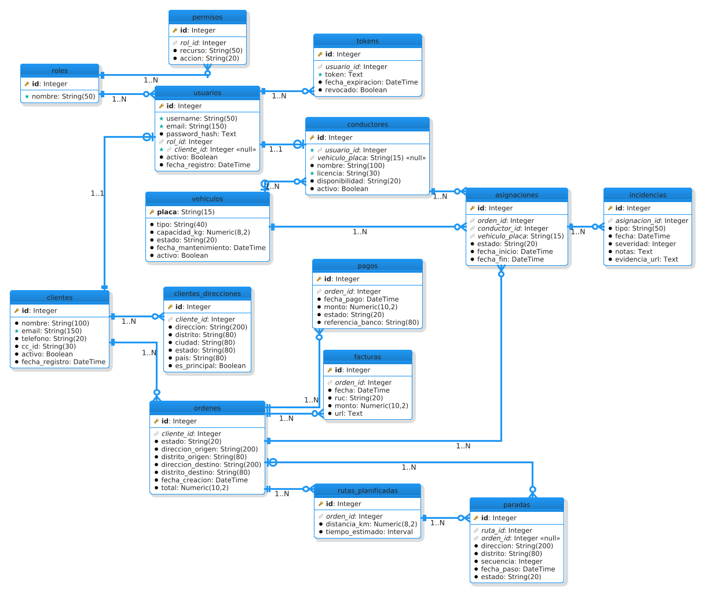

---

### MongoDB

El siguiente esquema corresponde a una base de datos NoSQL en MongoDB, diseñada
para complementar el sistema logístico mediante colecciones orientadas al seguimiento
operativo, viajes, alertas, geocercas y estadísticas. A diferencia de una base de datos
relacional, la información se organiza en documentos JSON, lo que permite almacenar
datos flexibles y consultar eventos del servicio de manera rápida.

- Colección `eventos_operacionales`: registra eventos generados durante la
  operación, como el escaneo de paquetes, junto con la fecha, dispositivo utilizado
  y datos adicionales del evento.
- Colección `alerta_logistica`: almacena alertas relacionadas con problemas
  logísticos, como desvíos de ruta o incumplimiento de geocercas, indicando si la
  alerta fue resuelta o no.
- Colección `viajes`: guarda información resumida de cada viaje, incluyendo la orden
  asociada, el conductor, la distancia estimada, el tiempo estimado y la cantidad de
  paradas.
- Colección `geocercas`: define zonas geográficas importantes, como almacenes o
  áreas de control, usando coordenadas en formato de polígono.
- Colección `estadisticas_por_orden`: almacena métricas de cada orden, como
  distancia recorrida, tiempo en tránsito y velocidad promedio.
- En conjunto, estas colecciones permiten monitorear la operación logística en
  tiempo real, controlar rutas, detectar incidencias y generar estadísticas útiles
  para la toma de decisiones.

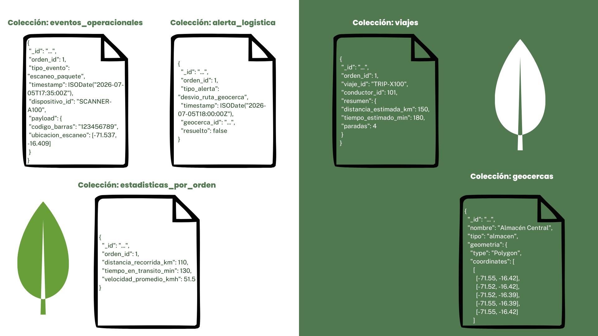

---

## Evidencias Postman

### Auth (Keycloak / OIDC)

> El **login, registro, refresh y logout** los gestiona **Keycloak**, no el backend. El
> frontend obtiene el token vía OIDC (Authorization Code + PKCE) y lo envía en
> `Authorization: Bearer`. El backend solo lo **valida** contra el JWKS de Keycloak y, en el
> primer acceso, **provisiona/enlaza** el usuario local por su `sub`. Flujos relevantes en
> Keycloak (realm `rappi2`):
>
> - **Autorización:** `GET {KEYCLOAK_URL}/realms/rappi2/protocol/openid-connect/auth`
> - **Token:** `POST {KEYCLOAK_URL}/realms/rappi2/protocol/openid-connect/token`
> - **Logout:** `GET {KEYCLOAK_URL}/realms/rappi2/protocol/openid-connect/logout`

#### `GET` /api/auth/me — Obtener usuario autenticado
- **Auth:** Bearer Token (emitido por Keycloak)
- **Body:** No requiere
- Devuelve el usuario local provisionado, su rol y los permisos del rol (para la UI).


---

### Roles y permisos

#### `GET` /api/roles/ — Listar todos los roles
- **Auth:** Bearer Token · Permiso: `roles:read`


#### `GET` /api/roles/{rol_id} — Obtener un rol por ID
- **Auth:** Bearer Token · Permiso: `roles:read`


#### `PATCH` /api/roles/{rol_id} — Actualizar nombre de rol
- **Auth:** Bearer Token · Permiso: `roles:write`
- **Body (JSON):**
```json
{ "nombre": "string" }
```


#### `DELETE` /api/roles/{rol_id} — Eliminar un rol
- **Auth:** Bearer Token · Permiso: `roles:delete`
- **Response:** `204 No Content`


#### `POST` /api/roles/{rol_id}/permisos — Agregar permiso a un rol
- **Auth:** Bearer Token · Permiso: `roles:write`
- **Body (JSON):**
```json
{ "recurso": "string", "accion": "string" }
```

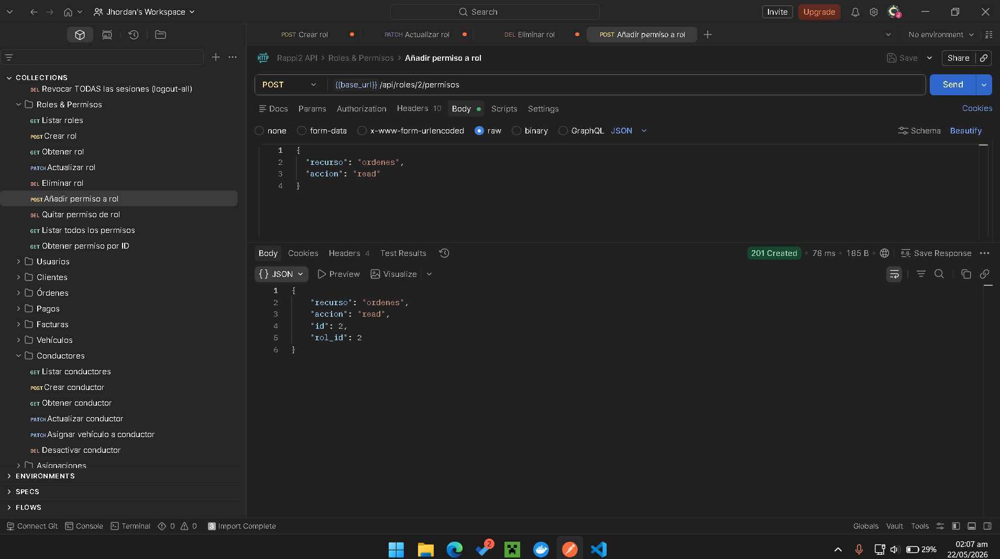

#### `DELETE` /api/roles/{rol_id}/permisos/{permiso_id} — Eliminar permiso de un rol
- **Auth:** Bearer Token · Permiso: `roles:write`
- **Response:** `204 No Content`

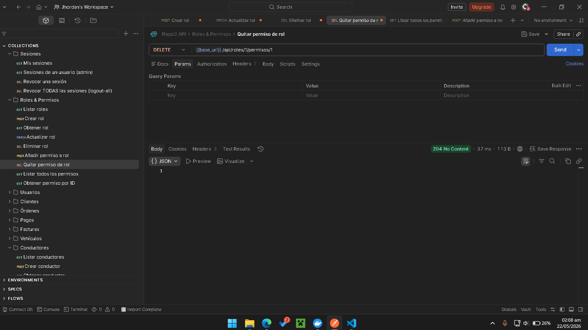

#### `GET` /api/roles/permisos/all — Listar todos los permisos
- **Auth:** Bearer Token · Permiso: `roles:read`
- **Query params:** `rol_id` · `recurso` (opcionales)


#### `GET` /api/roles/permisos/{permiso_id} — Obtener un permiso por ID
- **Auth:** Bearer Token · Permiso: `roles:read`

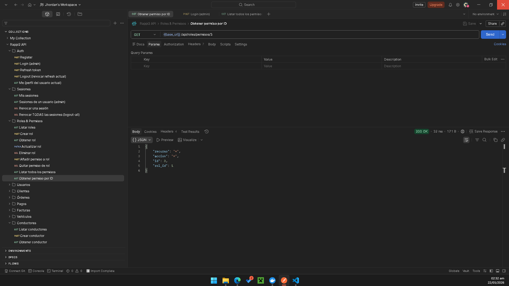

#### `POST` /api/roles/ — Crear un nuevo rol
- **Auth:** Bearer Token · Permiso: `roles:write`
- **Body (JSON):**
```json
{ "nombre": "string" }
```

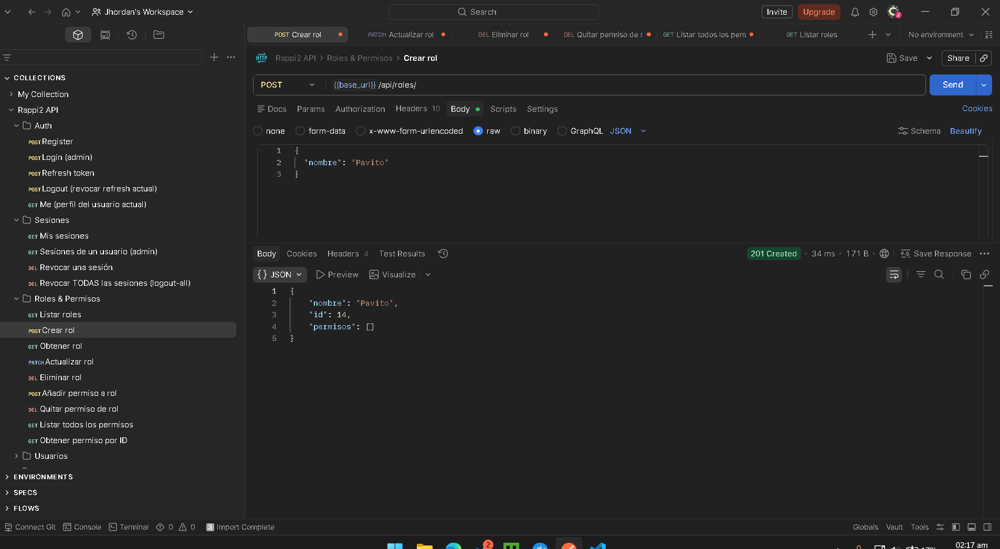

---

### Usuarios
#### `GET` /api/usuarios/ — Listar usuarios
- **Auth:** Bearer Token · Permiso: `usuarios:read`
- **Query params:** `skip` · `limit` · `activo`

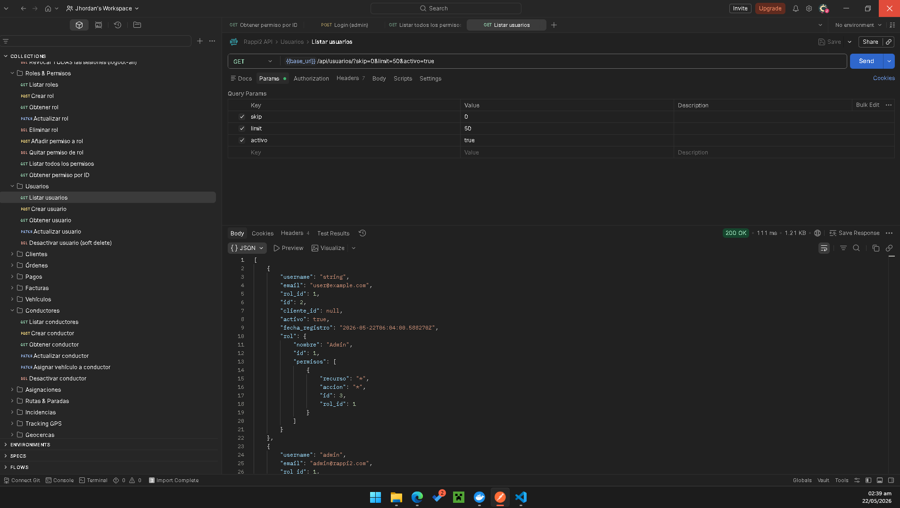

#### `GET` /api/usuarios/{usuario_id} — Obtener usuario por ID
- **Auth:** Bearer Token · Permiso: `usuarios:read`


#### `PATCH` /api/usuarios/{usuario_id} — Actualizar usuario
- **Auth:** Bearer Token · Permiso: `usuarios:write`
- **Body (JSON):**
```json
{ "email": "nuevo@email.com", "rol_id": 1, "activo": true, "password": "nueva_clave" }
```


#### `DELETE` /api/usuarios/{usuario_id} — Desactivar usuario (soft delete)
- **Auth:** Bearer Token · Permiso: `usuarios:delete`
- **Response:** `204 No Content`


#### `POST` /api/usuarios/ — Crear usuario
- **Auth:** Bearer Token · Permiso: `usuarios:write`
- **Body (JSON):**
```json
{ "username": "string", "email": "user@example.com", "password": "string", "rol_id": 1, "cliente_id": null }
```


---

### Clientes

#### `GET` /api/clientes/ — Listar clientes
- **Auth:** Bearer Token · Permiso: `clientes:read`
- **Query params:** `skip` · `limit` · `activo`


#### `POST` /api/clientes/ — Crear cliente
- **Auth:** Bearer Token · Permiso: `clientes:write`
- **Body (JSON):**
```json
{ "nombre": "string", "email": "cliente@email.com", "telefono": "999999999", "cc_id": "string" }
```

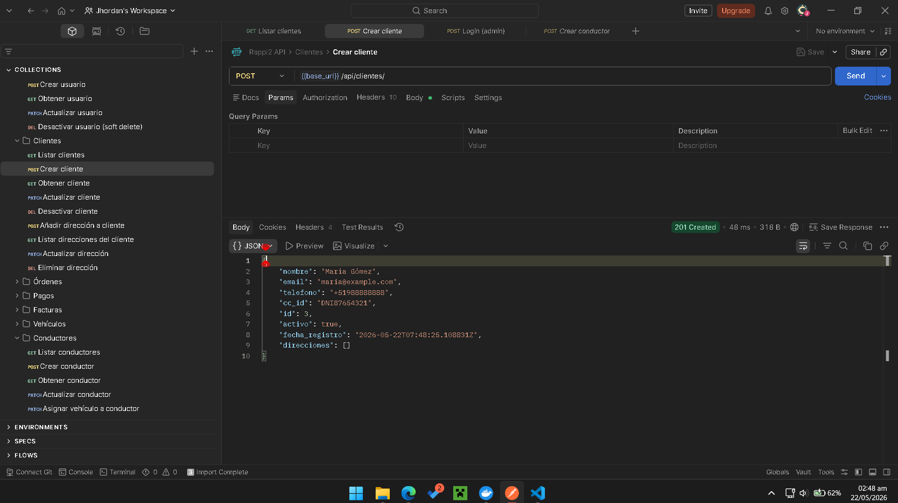

#### `GET` /api/clientes/{cliente_id} — Obtener cliente por ID
- **Auth:** Bearer Token · Permiso: `clientes:read`

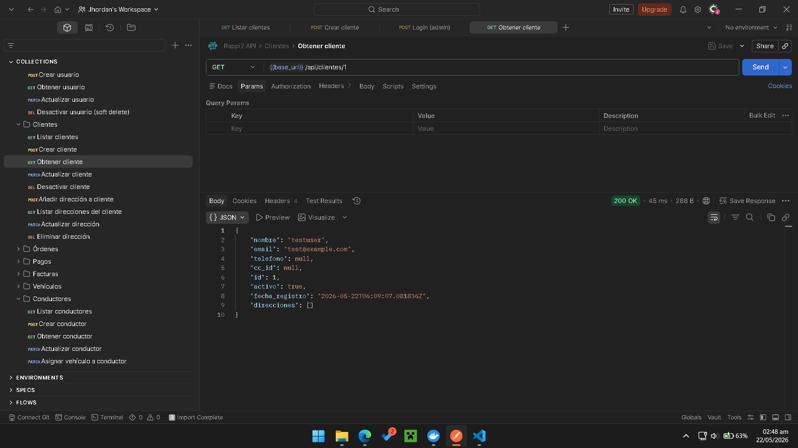

#### `PATCH` /api/clientes/{cliente_id} — Actualizar cliente
- **Auth:** Bearer Token · Permiso: `clientes:write`
- **Body (JSON):**
```json
{ "nombre": "string", "email": "nuevo@email.com", "telefono": "string", "activo": true }
```


#### `DELETE` /api/clientes/{cliente_id} — Desactivar cliente (soft delete)
- **Auth:** Bearer Token · Permiso: `clientes:delete`
- **Response:** `204 No Content`


#### `GET` /api/clientes/{cliente_id}/direcciones — Listar direcciones de un cliente
- **Auth:** Bearer Token · Permiso: `clientes:read`

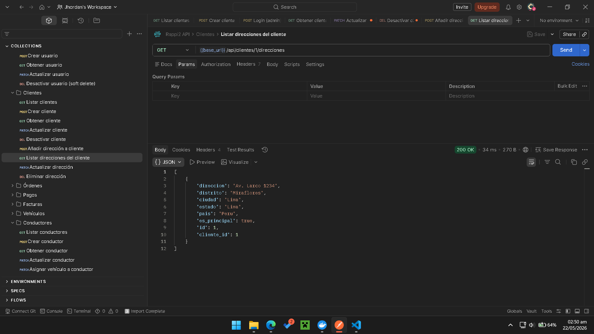

#### `POST` /api/clientes/{cliente_id}/direcciones — Agregar dirección
- **Auth:** Bearer Token · Permiso: `clientes:write`
- **Body (JSON):**
```json
{ "direccion": "Av. Ejemplo 123", "distrito": "Miraflores", "ciudad": "Lima", "pais": "PE", "es_principal": true }
```

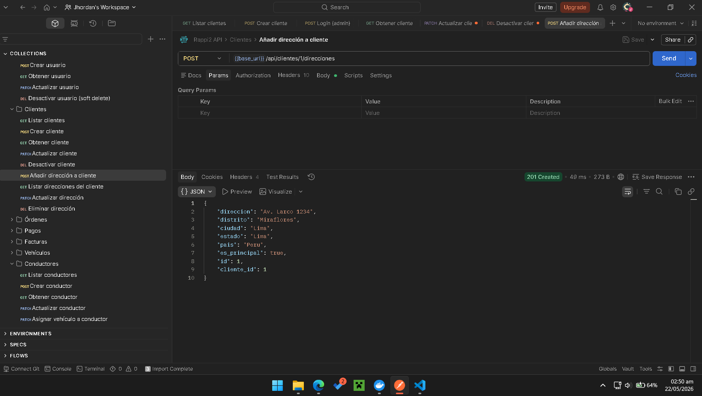

#### `PATCH` /api/clientes/{cliente_id}/direcciones/{direccion_id} — Actualizar dirección
- **Auth:** Bearer Token · Permiso: `clientes:write`

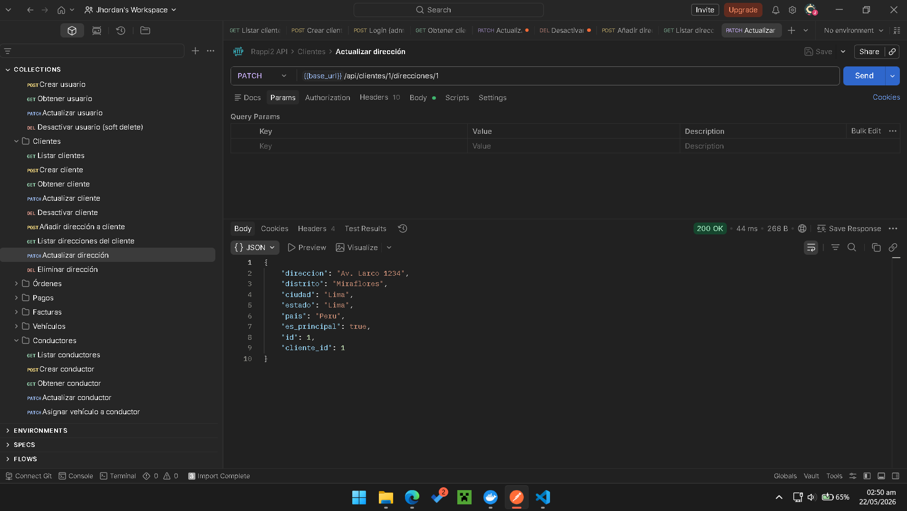

#### `DELETE` /api/clientes/{cliente_id}/direcciones/{direccion_id} — Eliminar dirección
- **Auth:** Bearer Token · Permiso: `clientes:write`
- **Response:** `204 No Content`


---

### Conductores

#### `GET` /api/conductores/ — Listar conductores
- **Auth:** Bearer Token · Permiso: `conductores:read`
- **Query params:** `skip` · `limit` · `activo` · `disponibilidad`


#### `POST` /api/conductores/ — Crear conductor
- **Auth:** Bearer Token · Permiso: `conductores:write`
- **Body (JSON):**
```json
{ "nombre": "string", "licencia": "ABC-123", "disponibilidad": "Disponible", "usuario_id": 1, "vehiculo_placa": "XYZ-999" }
```

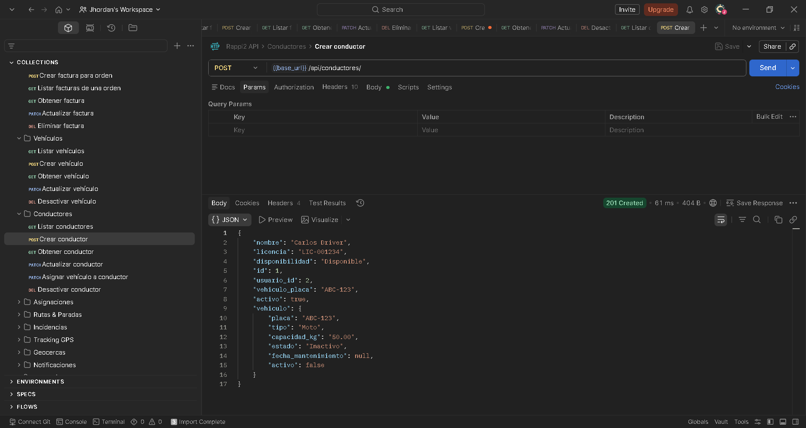

#### `GET` /api/conductores/{conductor_id} — Obtener conductor por ID
- **Auth:** Bearer Token · Permiso: `conductores:read`

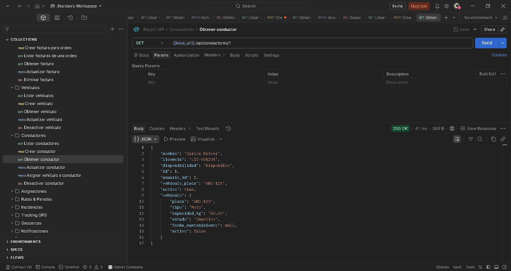

#### `PATCH` /api/conductores/{conductor_id} — Actualizar conductor
- **Auth:** Bearer Token · Permiso: `conductores:write`
- **Body (JSON):**
```json
{ "nombre": "string", "disponibilidad": "Disponible", "vehiculo_placa": "XYZ-999" }
```


#### `DELETE` /api/conductores/{conductor_id} — Desactivar conductor (soft delete)
- **Auth:** Bearer Token · Permiso: `conductores:delete`
- **Response:** `204 No Content`

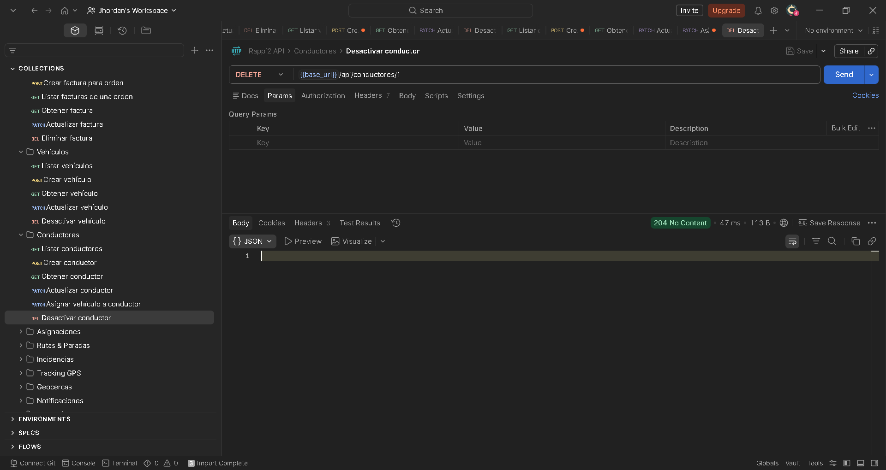

#### `PATCH` /api/conductores/{conductor_id}/vehiculo — Asignar/cambiar vehículo
- **Auth:** Bearer Token · Permiso: `conductores:write`
- **Body (JSON):**
```json
{ "vehiculo_placa": "XYZ-999" }
```


---

### Vehiculos

#### `GET` /api/vehiculos/ — Listar vehículos
- **Auth:** Bearer Token · Permiso: `vehiculos:read`
- **Query params:** `skip` · `limit` · `activo` · `estado`

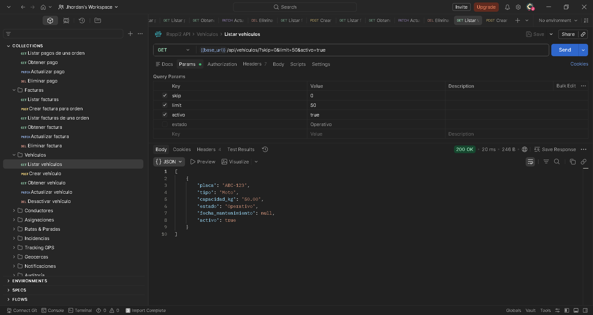

#### `POST` /api/vehiculos/ — Crear vehículo
- **Auth:** Bearer Token · Permiso: `vehiculos:write`
- **Body (JSON):**
```json
{ "placa": "ABC-123", "tipo": "Camioneta", "capacidad_kg": 1500.0, "estado": "Operativo" }
```


#### `GET` /api/vehiculos/{placa} — Obtener vehículo por placa
- **Auth:** Bearer Token · Permiso: `vehiculos:read`

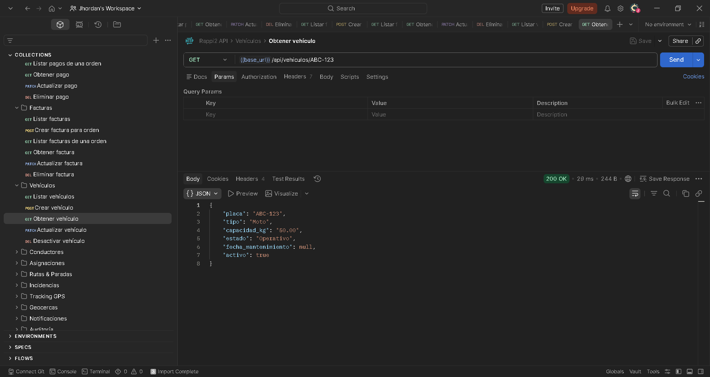

#### `PATCH` /api/vehiculos/{placa} — Actualizar vehículo
- **Auth:** Bearer Token · Permiso: `vehiculos:write`
- **Body (JSON):**
```json
{ "tipo": "string", "capacidad_kg": 2000.0, "estado": "En Mantenimiento" }
```

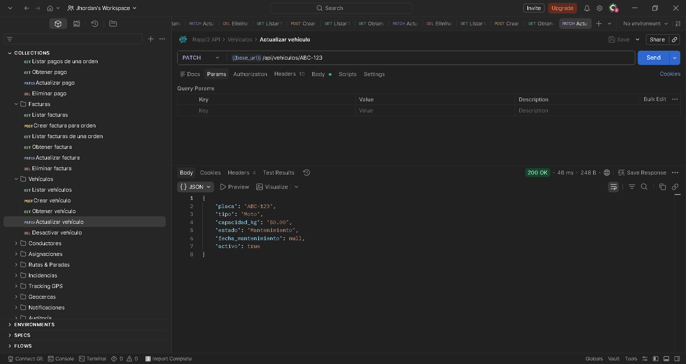

#### `DELETE` /api/vehiculos/{placa} — Desactivar vehículo (soft delete)
- **Auth:** Bearer Token · Permiso: `vehiculos:delete`
- **Response:** `204 No Content`


---

### Ordenes

#### `GET` /api/ordenes/ — Listar órdenes
- **Auth:** Bearer Token · Permiso: `ordenes:read`
- **Query params:** `skip` · `limit` · `cliente_id` · `estado`


#### `POST` /api/ordenes/ — Crear orden
- **Auth:** Bearer Token · Permiso: `ordenes:write`
- **Body (JSON):**
```json
{
  "cliente_id": 1,
  "direccion_origen": "Av. Origen 100",
  "distrito_origen": "SJL",
  "direccion_destino": "Calle Destino 200",
  "distrito_destino": "Miraflores",
  "total": 150.00
}
```

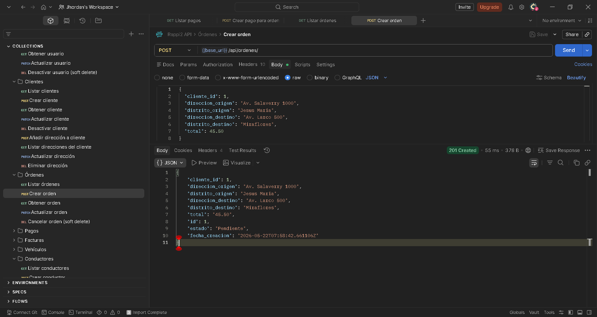

#### `GET` /api/ordenes/{orden_id} — Obtener orden por ID
- **Auth:** Bearer Token · Permiso: `ordenes:read`

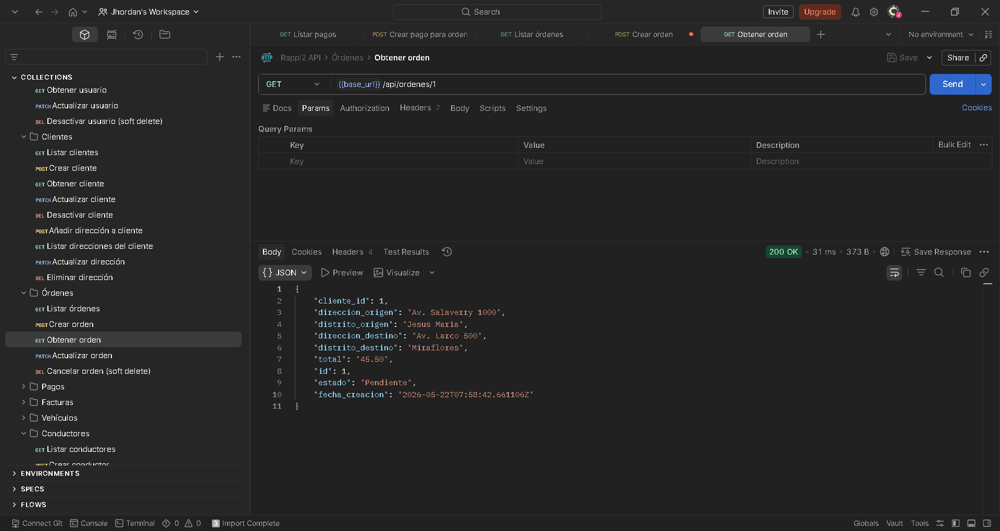

#### `PATCH` /api/ordenes/{orden_id} — Actualizar orden
- **Auth:** Bearer Token · Permiso: `ordenes:write`
- **Body (JSON):**
```json
{ "estado": "En Proceso", "direccion_destino": "Nueva dirección", "total": 200.00 }
```


#### `DELETE` /api/ordenes/{orden_id} — Cancelar orden (cambia estado a "Cancelado")
- **Auth:** Bearer Token · Permiso: `ordenes:delete`
- **Response:** `204 No Content`


#### `GET` /api/ordenes/{orden_id}/pagos — Listar pagos de una orden
- **Auth:** Bearer Token · Permiso: `pagos:read`

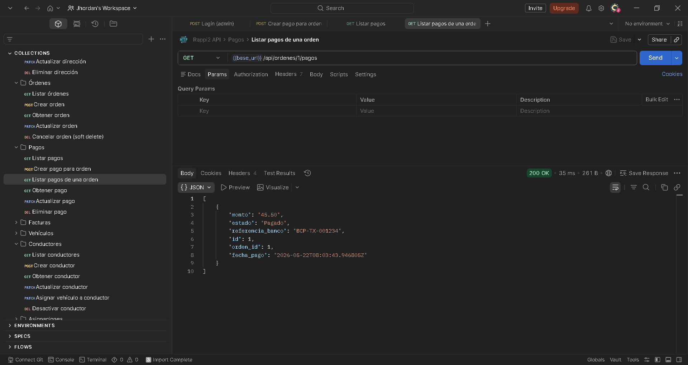

#### `GET` /api/ordenes/{orden_id}/facturas — Listar facturas de una orden
- **Auth:** Bearer Token · Permiso: `facturas:read`

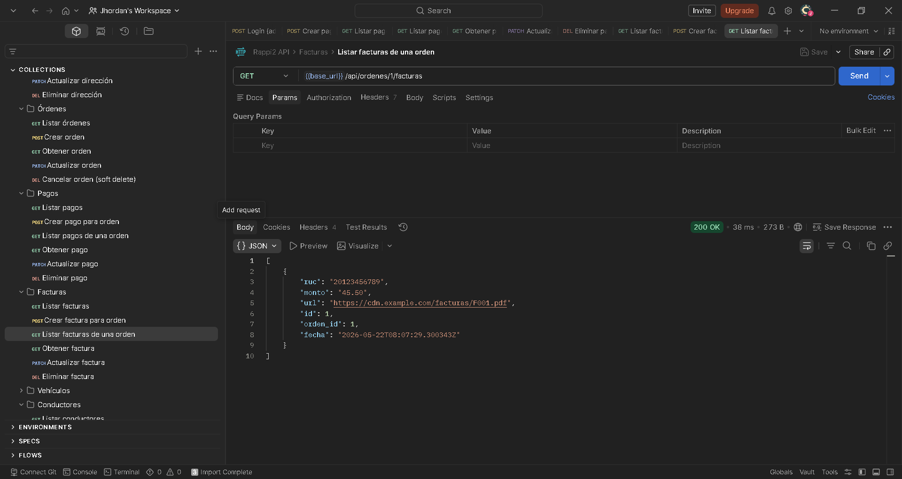

---

### Pagos

#### `GET` /api/pagos — Listar todos los pagos
- **Auth:** Bearer Token · Permiso: `pagos:read`
- **Query params:** `skip` · `limit` · `estado` · `desde` · `hasta`


#### `POST` /api/ordenes/{orden_id}/pagos — Registrar pago para una orden
- **Auth:** Bearer Token · Permiso: `pagos:write`
- **Body (JSON):**
```json
{ "monto": 150.00, "estado": "Pendiente", "referencia_banco": "REF-001" }
```

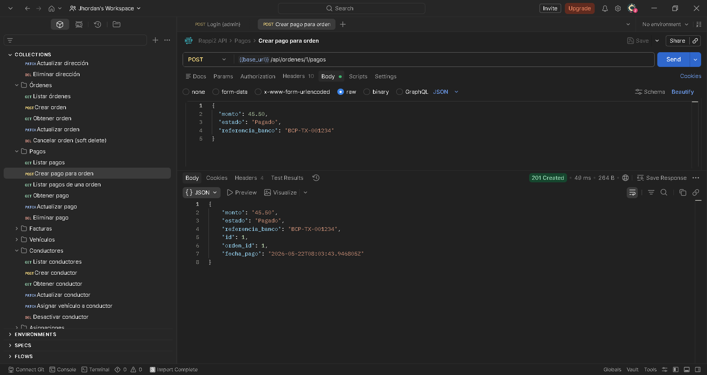

#### `GET` /api/pagos/{pago_id} — Obtener pago por ID
- **Auth:** Bearer Token · Permiso: `pagos:read`

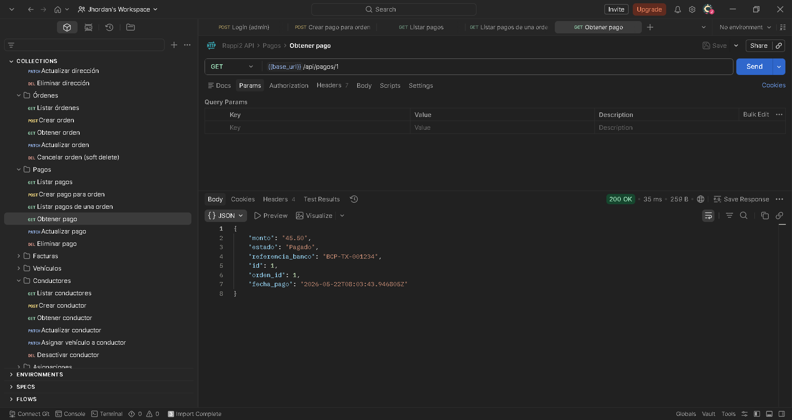

#### `PATCH` /api/pagos/{pago_id} — Actualizar pago
- **Auth:** Bearer Token · Permiso: `pagos:write`
- **Body (JSON):**
```json
{ "estado": "Pagado", "referencia_banco": "REF-002" }
```


#### `DELETE` /api/pagos/{pago_id} — Eliminar pago
- **Auth:** Bearer Token · Permiso: `pagos:delete`
- **Response:** `204 No Content`

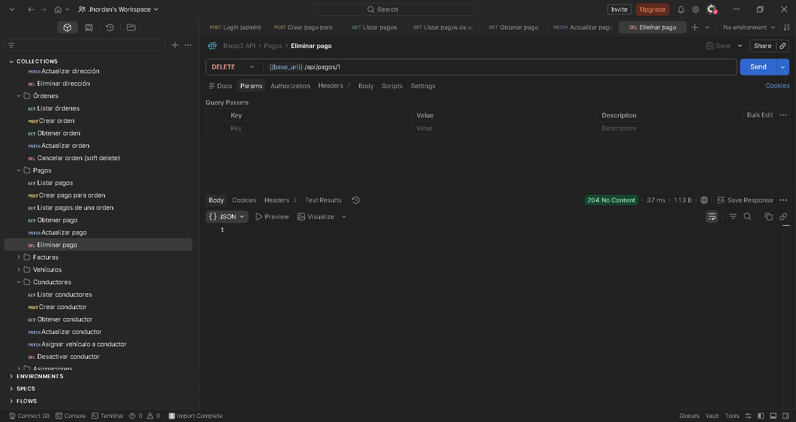

---

### Facturas

#### `GET` /api/facturas — Listar todas las facturas
- **Auth:** Bearer Token · Permiso: `facturas:read`
- **Query params:** `skip` · `limit` · `ruc` · `desde` · `hasta`


#### `POST` /api/ordenes/{orden_id}/facturas — Crear factura para una orden
- **Auth:** Bearer Token · Permiso: `facturas:write`
- **Body (JSON):**
```json
{ "ruc": "20123456789", "monto": 150.00, "url": "https://factura.pdf" }
```


#### `GET` /api/facturas/{factura_id} — Obtener factura por ID
- **Auth:** Bearer Token · Permiso: `facturas:read`


#### `PATCH` /api/facturas/{factura_id} — Actualizar factura
- **Auth:** Bearer Token · Permiso: `facturas:write`
- **Body (JSON):**
```json
{ "ruc": "20123456789", "monto": 200.00, "url": "https://nueva-factura.pdf" }
```


#### `DELETE` /api/facturas/{factura_id} — Eliminar factura
- **Auth:** Bearer Token · Permiso: `facturas:delete`
- **Response:** `204 No Content`


---

### Root / Docs

#### `GET` / — Información del servicio
- **Auth:** No requiere


#### `GET` /docs — Swagger UI (documentación interactiva)
- **Auth:** No requiere


#### `GET` /openapi.json — Esquema OpenAPI
- **Auth:** No requiere


---

### Asignaciones

#### `GET` /api/asignaciones/ — Listar asignaciones
- **Auth:** Bearer Token · Permiso: `asignaciones:read`
- **Query params:** `skip` · `limit` · `estado` · `conductor_id`

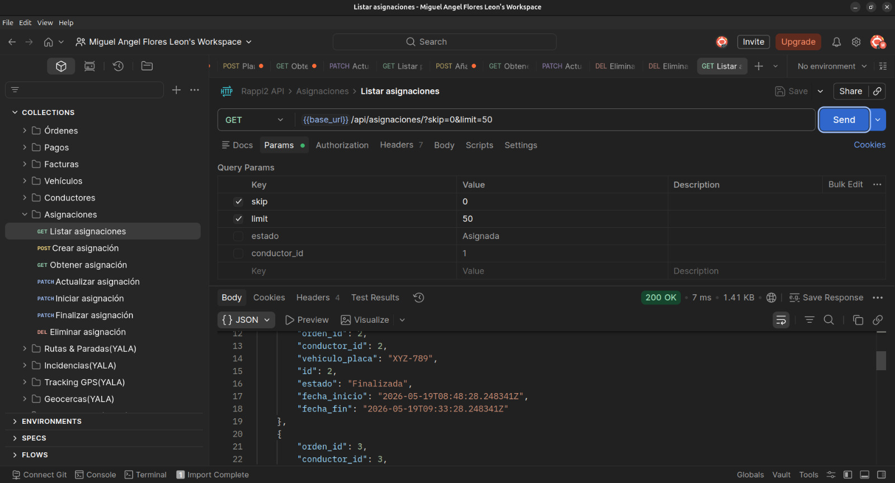

#### `GET` /api/asignaciones/{asignacion_id} — Obtener asignación por ID
- **Auth:** Bearer Token · Permiso: `asignaciones:read`

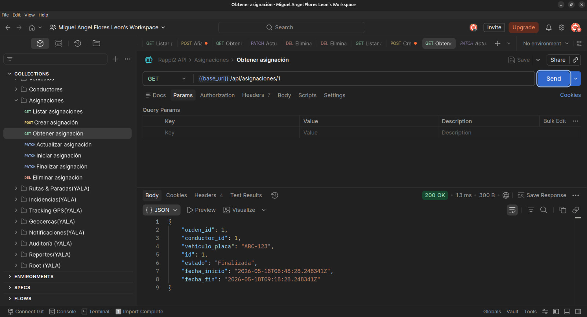

#### `POST` /api/asignaciones/ — Crear asignación
- **Auth:** Bearer Token · Permiso: `asignaciones:write`
- **Body (JSON):**
```json
{ "orden_id": 1, "conductor_id": 1, "vehiculo_placa": "ABC-123" }
```


#### `PATCH` /api/asignaciones/{asignacion_id} — Actualizar asignación
- **Auth:** Bearer Token · Permiso: `asignaciones:write`
- **Body (JSON):**
```json
{ "estado": "Asignada", "fecha_inicio": null, "fecha_fin": null }
```


#### `PATCH` /api/asignaciones/{asignacion_id}/iniciar — Iniciar asignación
- **Auth:** Bearer Token · Permiso: `asignaciones:write`
- **Body:** No requiere (cambia estado a "EnCurso" y orden a "En Tránsito")

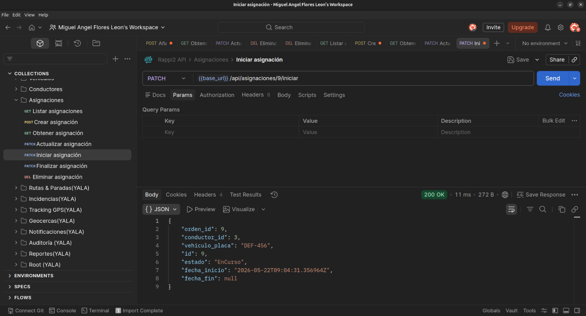

#### `PATCH` /api/asignaciones/{asignacion_id}/finalizar — Finalizar asignación
- **Auth:** Bearer Token · Permiso: `asignaciones:write`
- **Body:** No requiere (cambia estado a "Finalizada" y orden a "Entregado")


#### `DELETE` /api/asignaciones/{asignacion_id} — Eliminar asignación
- **Auth:** Bearer Token · Permiso: `asignaciones:delete`
- **Response:** `204 No Content`


---

### Auditoría

#### `GET` /api/auditoria/ — Listar logs de auditoría
- **Auth:** Bearer Token · Permiso: `auditoria:read`
- **Query params:** `usuario_id` · `metodo` · `skip` · `limit`


#### `GET` /api/auditoria/resumen — Resumen agregado de auditoría
- **Auth:** Bearer Token · Permiso: `auditoria:read`
- **Query params:** `horas` (ventana en horas, 1–720)


---

### Geocercas

#### `GET` /api/geocercas — Listar geocercas
- **Auth:** Bearer Token · Permiso: `geocercas:read`
- **Query params:** `ruta_id` · `activa`

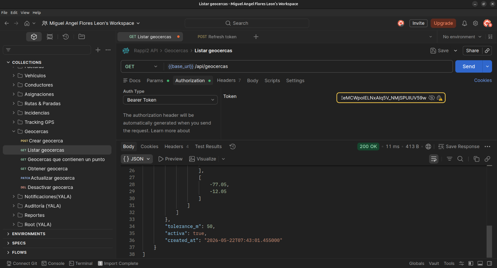

#### `GET` /api/geocercas/{geocerca_id} — Obtener geocerca por ID
- **Auth:** Bearer Token · Permiso: `geocercas:read`

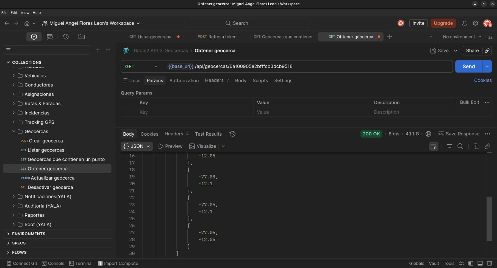

#### `POST` /api/geocercas — Crear geocerca
- **Auth:** Bearer Token · Permiso: `geocercas:write`
- **Body (JSON):**
```json
{ "ruta_id": 1, "orden_id": 1, "tipo": "zona_entrega", "coordinates": [[[-77.0, -12.0], [-77.1, -12.0], [-77.1, -12.1], [-77.0, -12.0]]], "activa": true }
```


#### `PATCH` /api/geocercas/{geocerca_id} — Actualizar geocerca
- **Auth:** Bearer Token · Permiso: `geocercas:write`
- **Body (JSON):**
```json
{ "tipo": "almacen", "activa": false }
```


#### `DELETE` /api/geocercas/{geocerca_id} — Desactivar geocerca
- **Auth:** Bearer Token · Permiso: `geocercas:delete`
- **Response:** `204 No Content`

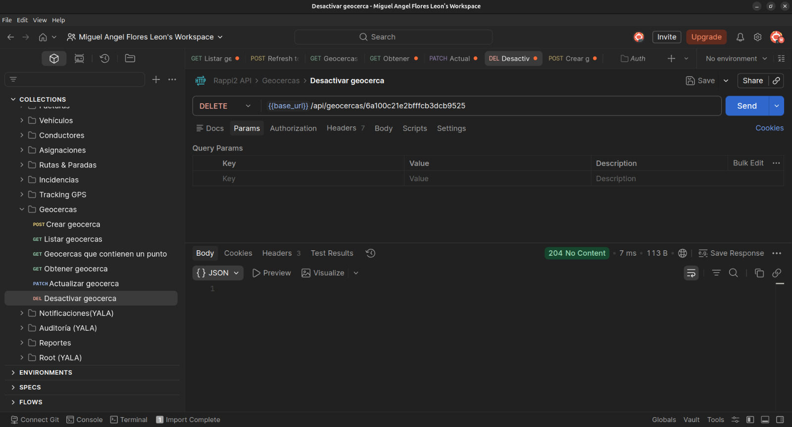

#### `GET` /api/geocercas/contiene?lon={lon}&lat={lat} — Geocercas que contienen un punto
- **Auth:** Bearer Token · Permiso: `geocercas:read`
- **Query params (obligatorios):** `lon` · `lat`


---

### Incidencias (CRUD)

#### `GET` /api/incidencias/ — Listar incidencias
- **Auth:** Bearer Token · Permiso: `incidencias:read`
- **Query params:** `skip` · `limit` · `asignacion_id` · `severidad_min`

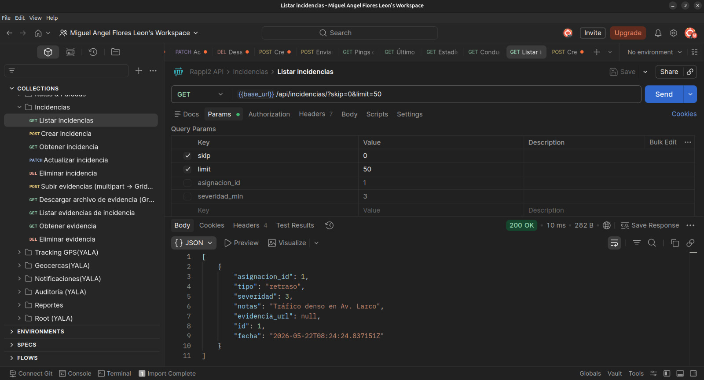

#### `GET` /api/incidencias/{incidencia_id} — Obtener incidencia por ID
- **Auth:** Bearer Token · Permiso: `incidencias:read`


#### `POST` /api/incidencias/ — Crear incidencia
- **Auth:** Bearer Token · Permiso: `incidencias:write`
- **Body (JSON):**
```json
{ "asignacion_id": 1, "tipo": "Retraso", "severidad": 3, "notas": "Descripción del problema" }
```

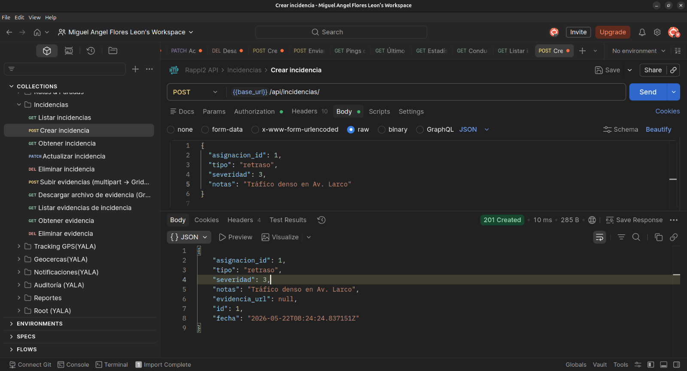

#### `PATCH` /api/incidencias/{incidencia_id} — Actualizar incidencia
- **Auth:** Bearer Token · Permiso: `incidencias:write`
- **Body (JSON):**
```json
{ "tipo": "Daño", "severidad": 5, "notas": "Actualización" }
```

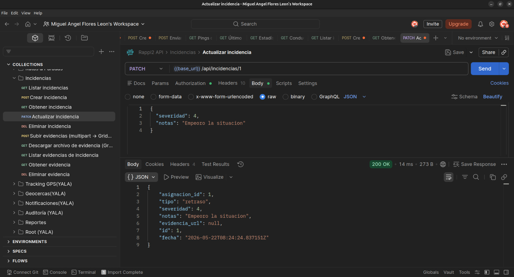

#### `DELETE` /api/incidencias/{incidencia_id} — Eliminar incidencia
- **Auth:** Bearer Token · Permiso: `incidencias:delete`
- **Response:** `204 No Content`

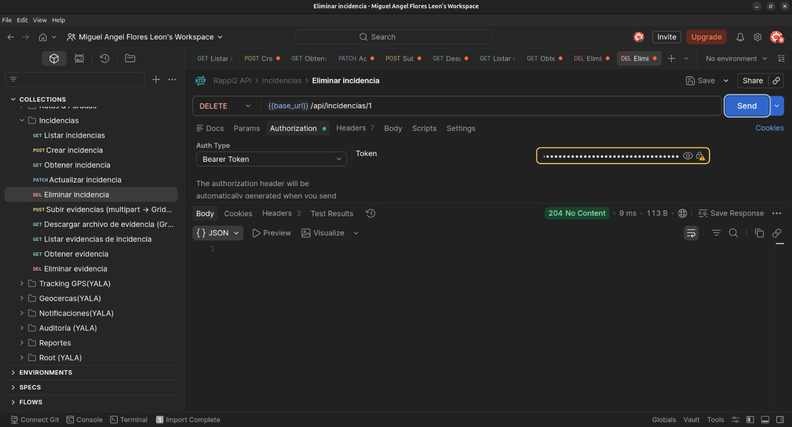

---

### Incidencias (Evidencias)

#### `GET` /api/incidencias/{incidencia_id}/evidencias — Listar evidencias de una incidencia
- **Auth:** Bearer Token · Permiso: `incidencias:read`

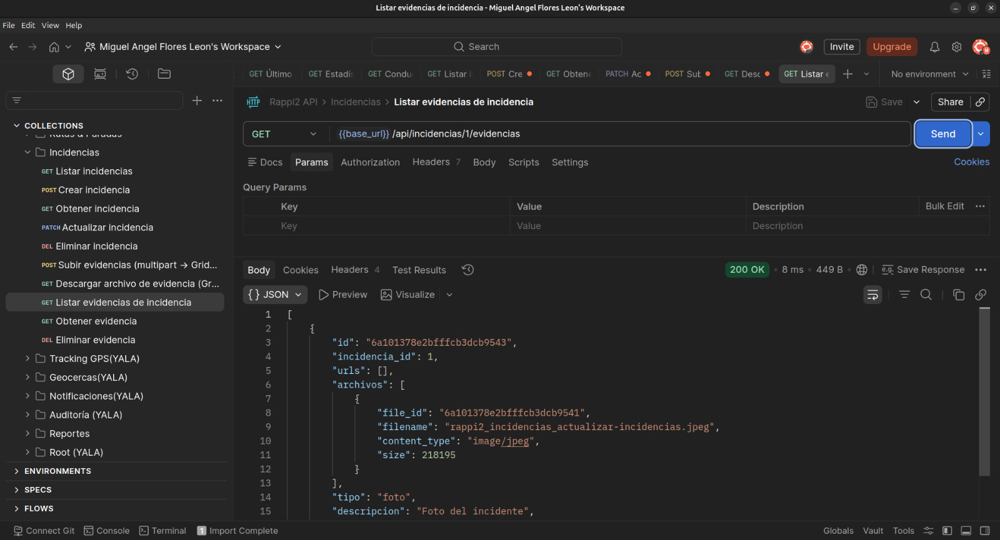

#### `GET` /api/incidencias/evidencias/{evidencia_id} — Obtener evidencia por ID
- **Auth:** Bearer Token · Permiso: `incidencias:read`


#### `POST` /api/incidencias/{incidencia_id}/evidencias/upload — Subir evidencia (multipart)
- **Auth:** Bearer Token · Permiso: `incidencias:write`
- **Content-Type:** `multipart/form-data`
- **Form fields:** `tipo` (foto/video/audio/documento) · `descripcion` · `archivos` (files)


#### `GET` /api/incidencias/evidencias/archivos/{file_id} — Descargar archivo de evidencia
- **Auth:** Bearer Token · Permiso: `incidencias:read`


#### `DELETE` /api/incidencias/evidencias/{evidencia_id} — Eliminar evidencia
- **Auth:** Bearer Token · Permiso: `incidencias:delete`
- **Response:** `204 No Content`


---

### Notificaciones

#### `GET` /api/notificaciones/mias — Mis notificaciones
- **Auth:** Bearer Token (usuario autenticado)
- **Query params:** `leida` (bool) · `skip` · `limit`

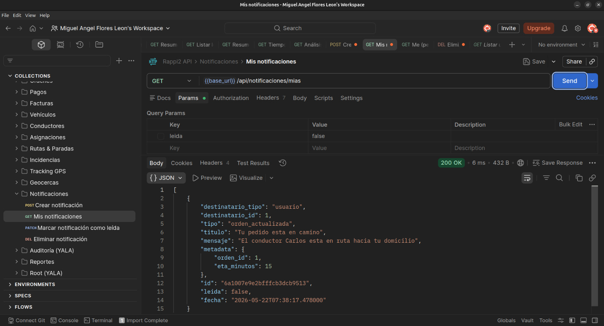

#### `POST` /api/notificaciones/ — Crear notificación
- **Auth:** Bearer Token · Permiso: `notificaciones:write`
- **Body (JSON):**
```json
{
  "destinatario_tipo": "cliente",
  "destinatario_id": 1,
  "tipo": "orden_actualizada",
  "titulo": "Tu orden fue enviada",
  "mensaje": "El conductor está en camino",
  "metadata": {}
}
```

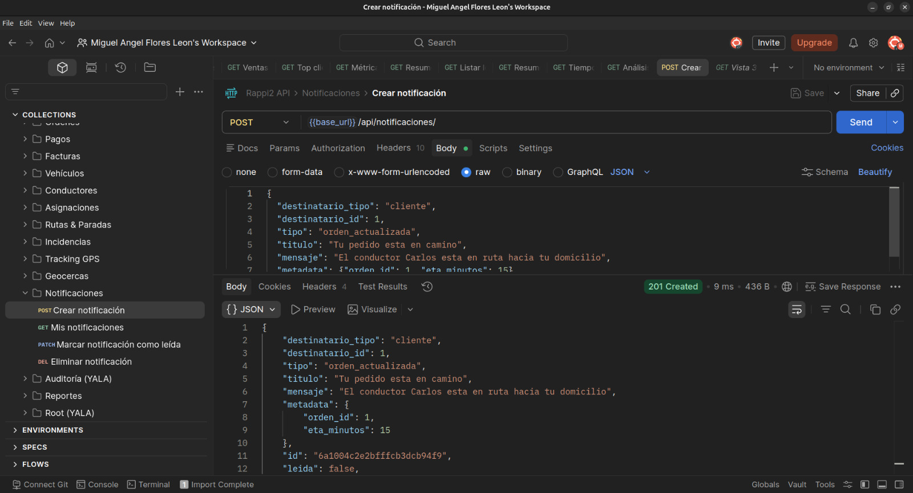

#### `PATCH` /api/notificaciones/{notif_id}/leer — Marcar notificación como leída
- **Auth:** Bearer Token (usuario autenticado)
- **Body:** No requiere

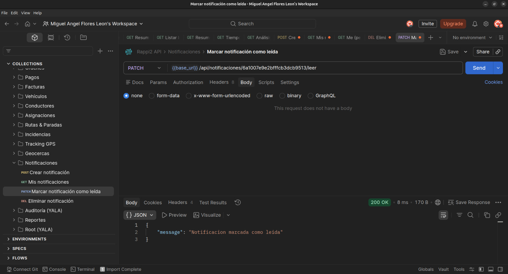

#### `DELETE` /api/notificaciones/{notif_id} — Eliminar notificación
- **Auth:** Bearer Token (usuario autenticado)
- **Response:** `204 No Content`

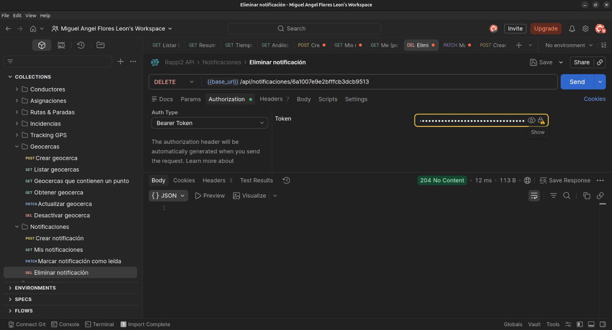

---

### Tracking GPS

#### `POST` /api/tracking/ping — Enviar ping GPS
- **Auth:** Bearer Token · Permiso: `tracking:write`
- **Body (JSON):**
```json
{
  "asignacion_id": 1,
  "conductor_id": 1,
  "vehiculo_placa": "ABC-123",
  "lon": -77.0428,
  "lat": -12.0464,
  "speed_kmh": 35.5,
  "heading": 180.0,
  "accuracy_m": 5.0
}
```


#### `GET` /api/tracking/asignacion/{asignacion_id} — Pings GPS de una asignación
- **Auth:** Bearer Token · Permiso: `tracking:read`
- **Query params:** `desde` · `hasta` · `limit`


#### `GET` /api/tracking/asignacion/{asignacion_id}/ultimo — Último ping de una asignación
- **Auth:** Bearer Token · Permiso: `tracking:read`

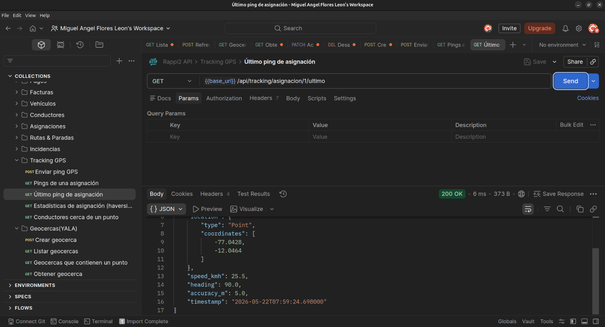

#### `GET` /api/tracking/asignacion/{asignacion_id}/estadisticas — Estadísticas de recorrido
- **Auth:** Bearer Token · Permiso: `tracking:read`


#### `GET` /api/tracking/conductores-cerca — Conductores cercanos a un punto
- **Auth:** Bearer Token · Permiso: `tracking:read`
- **Query params (obligatorios):** `lon` · `lat`
- **Query params (opcionales):** `radio_m` (default: 2000) · `ventana_min` (default: 5)


---

### Reportes / KPIs

#### `GET` /api/reportes/dashboard — Dashboard general (KPIs)
- **Auth:** Bearer Token · Permiso: `reportes:read`

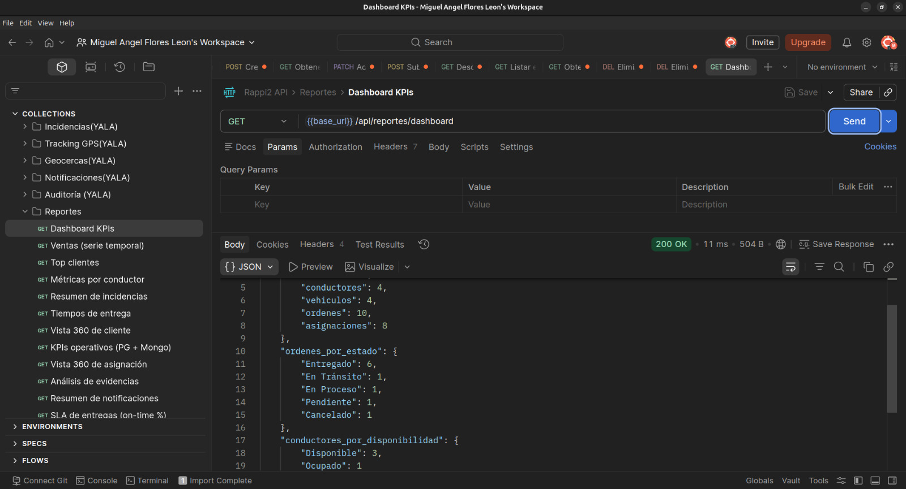

#### `GET` /api/reportes/operativo — KPIs operativos en tiempo real
- **Auth:** Bearer Token · Permiso: `reportes:read`
- **Query params:** `ventana_minutos` (default: 5)


#### `GET` /api/reportes/sla-entregas — SLA de entregas
- **Auth:** Bearer Token · Permiso: `reportes:read`
- **Query params:** `desde` · `hasta` · `sla_minutos` (default: 60)


#### `GET` /api/reportes/tiempos-entrega — Tiempos de entrega (promedio, min, max)
- **Auth:** Bearer Token · Permiso: `reportes:read`
- **Query params:** `desde` · `hasta`

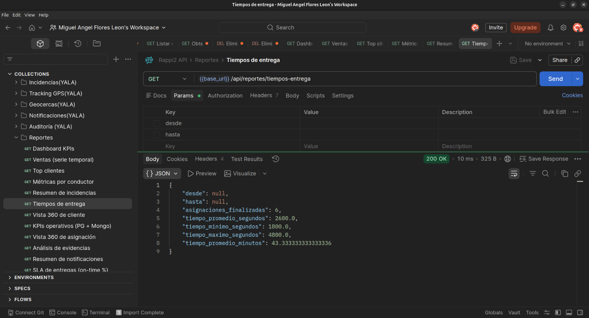

#### `GET` /api/reportes/ventas — Ventas (serie temporal)
- **Auth:** Bearer Token · Permiso: `reportes:read`
- **Query params:** `desde` · `hasta` · `granularidad` ("dia" | "mes")


#### `GET` /api/reportes/top-clientes — Top clientes por recaudación
- **Auth:** Bearer Token · Permiso: `reportes:read`
- **Query params:** `limit` (default: 10)

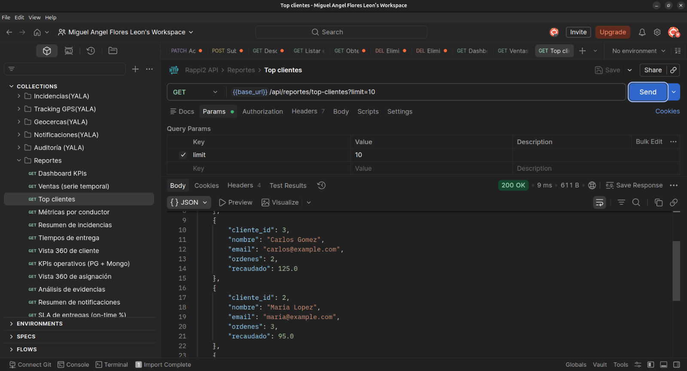

#### `GET` /api/reportes/conductores/eficiencia — Eficiencia por conductor
- **Auth:** Bearer Token · Permiso: `reportes:read`
- **Query params:** `desde` · `hasta` · `limit`

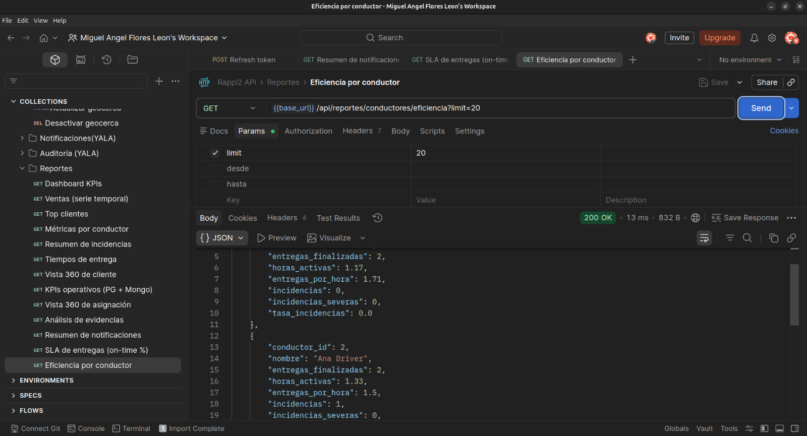

#### `GET` /api/reportes/conductores — Métricas por conductor
- **Auth:** Bearer Token · Permiso: `reportes:read`


#### `GET` /api/reportes/incidencias — Resumen de incidencias
- **Auth:** Bearer Token · Permiso: `reportes:read`
- **Query params:** `desde` · `hasta`


#### `GET` /api/reportes/notificaciones — Resumen de notificaciones
- **Auth:** Bearer Token · Permiso: `reportes:read`
- **Query params:** `horas` (ventana en horas, 1–720)


#### `GET` /api/reportes/evidencias — Análisis de evidencias
- **Auth:** Bearer Token · Permiso: `reportes:read`

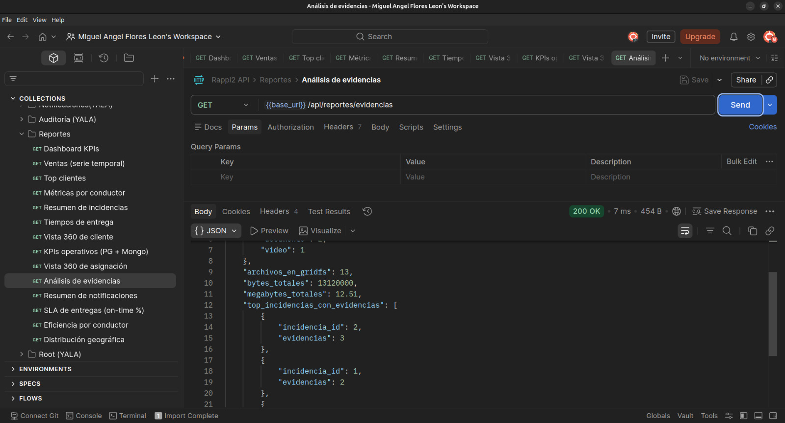

#### `GET` /api/reportes/asignacion/{asignacion_id}/completo — Vista 360° de asignación
- **Auth:** Bearer Token · Permiso: `reportes:read`


#### `GET` /api/reportes/cliente/{cliente_id}/resumen — Vista 360° de cliente
- **Auth:** Bearer Token · Permiso: `reportes:read`


---

### Rutas y Paradas

#### `POST` /api/rutas/planificar — Planificar ruta con OpenRouteService
- **Auth:** Bearer Token · Permiso: `rutas:write`
- **Body (JSON):**
```json
{
  "orden_id": 1,
  "origen_lon": -77.0428, "origen_lat": -12.0464,
  "destino_lon": -77.0300, "destino_lat": -12.1200,
  "generar_geocerca": true,
  "tolerancia_metros": 50
}
```


#### `GET` /api/rutas/ — Listar rutas planificadas
- **Auth:** Bearer Token · Permiso: `rutas:read`
- **Query params:** `orden_id`


#### `GET` /api/rutas/{ruta_id} — Obtener ruta por ID
- **Auth:** Bearer Token · Permiso: `rutas:read`

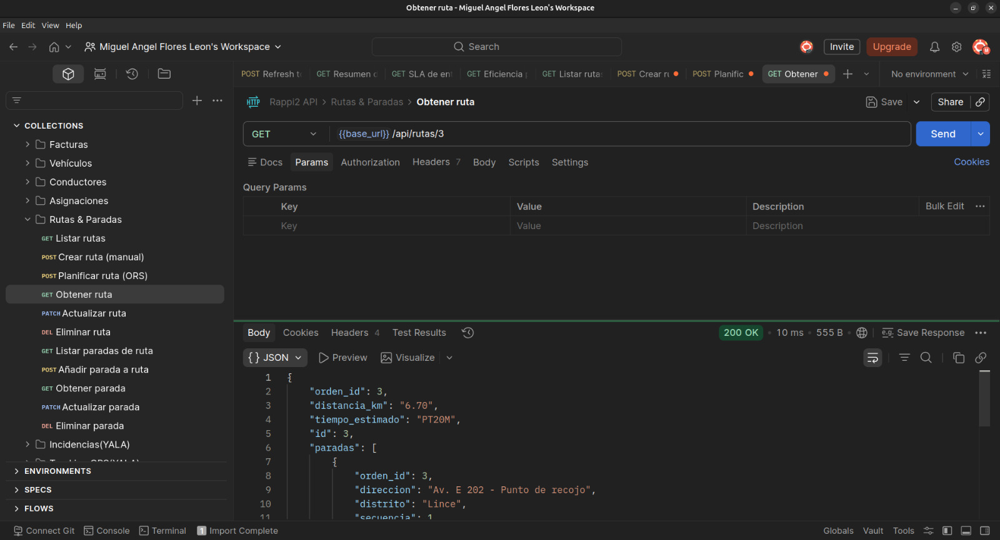

#### `POST` /api/rutas/ — Crear ruta manualmente
- **Auth:** Bearer Token · Permiso: `rutas:write`
- **Body (JSON):**
```json
{ "orden_id": 1, "distancia_km": 15.5, "tiempo_estimado": "00:45:00", "paradas": [] }
```

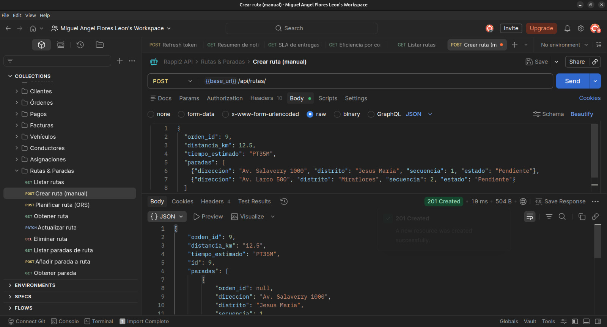

#### `PATCH` /api/rutas/{ruta_id} — Actualizar ruta
- **Auth:** Bearer Token · Permiso: `rutas:write`
- **Body (JSON):**
```json
{ "distancia_km": 20.0, "tiempo_estimado": "01:00:00" }
```


#### `DELETE` /api/rutas/{ruta_id} — Eliminar ruta
- **Auth:** Bearer Token · Permiso: `rutas:delete`
- **Response:** `204 No Content`

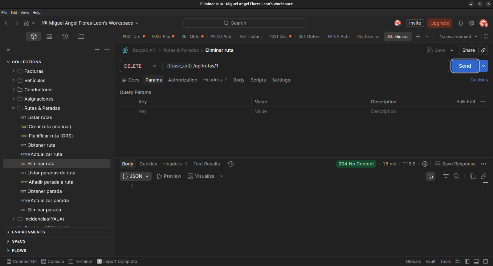

#### `GET` /api/rutas/{ruta_id}/paradas — Listar paradas de una ruta
- **Auth:** Bearer Token · Permiso: `rutas:read`

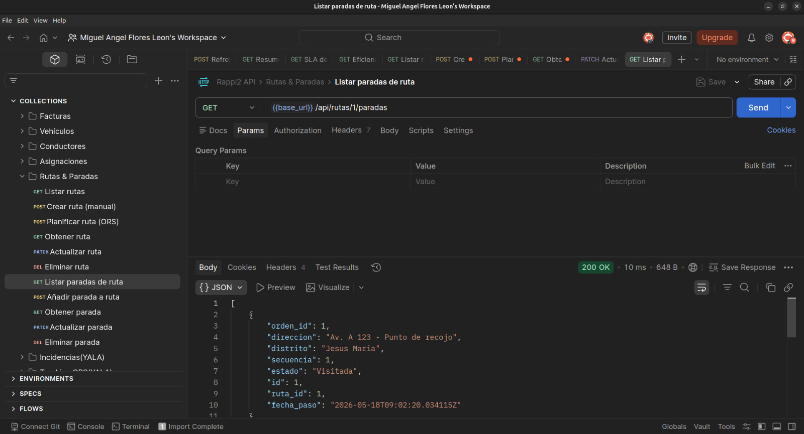

#### `GET` /api/rutas/{ruta_id}/paradas/{parada_id} — Obtener parada por ID
- **Auth:** Bearer Token · Permiso: `rutas:read`


#### `POST` /api/rutas/{ruta_id}/paradas — Agregar parada a una ruta
- **Auth:** Bearer Token · Permiso: `rutas:write`
- **Body (JSON):**
```json
{ "orden_id": 1, "direccion": "Av. Parada 300", "distrito": "Surco", "secuencia": 1, "estado": "Pendiente" }
```

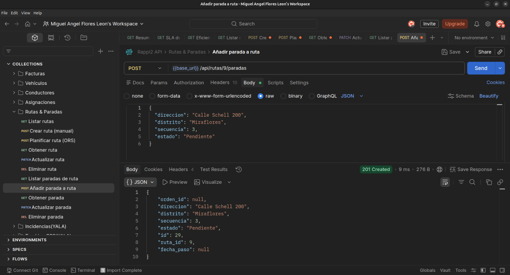

#### `PATCH` /api/rutas/{ruta_id}/paradas/{parada_id} — Actualizar parada
- **Auth:** Bearer Token · Permiso: `rutas:write`
- **Body (JSON):**
```json
{ "estado": "Completada", "direccion": "Nueva dirección" }
```


#### `DELETE` /api/rutas/{ruta_id}/paradas/{parada_id} — Eliminar parada
- **Auth:** Bearer Token · Permiso: `rutas:write`
- **Response:** `204 No Content`


---
